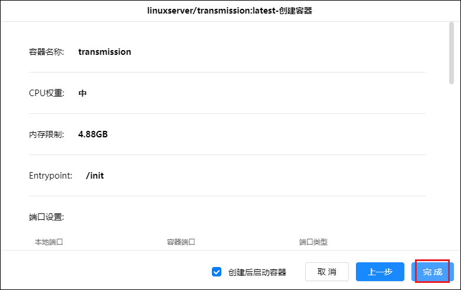
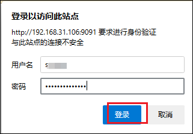

## 1、容器安装

1、在绿联云APP里打开docker，在镜像管理-镜像仓库中搜索transmission并点击下载，版本选择最新版本即可（latest）。

2、下载好后在本地镜像中找到已经下载好的镜像，点击创建容器。容器名称可以自定义，资源限制也可自定义，勾选创建后启动容器，然后点击下一步。

3、基础设置中重启策略选择最后一个【容器退出时重启（不考虑在进程启...）】，网络和命令保持默认即可。

4、存储空间中，按以下来配置，注意类型是读写。

|文件/文件夹                           |装载路径| 说明                 |
|:-----------------------------------| ----:|---------------------|
 /docker盘/Docker/transmission/config|/config| transmission配置文件夹|
 /娱乐盘/影视                          |	/hdd| 影视文件夹，可自定义     |

5、端口设置中本地端口和容器端口保持一样就行。

6、环境中添加如下名称和值，然后点击下一步。

| 环境名称               |          环境值  | 说明                 |
|:---------------------|--------------:|-----------------------|
 TZ                    | Asia/Shanghai | 时区                   |
 PUID                  |             0 | 容器内进程的用户ID，默认0  |
 PGID                  |             0 | 容器内进程所属的用户组ID，默认0 |
 USER                  |           *** | web登陆用户名，可自定义      |
 PASS                  |           *** | web登陆密码，可自定义      |
| TRANSMISSION_WEB_HOME|   /config/web | 下载[皮肤压缩包文件](https://github.com/transmission-web-control/transmission-web-control/releases/)，将解压后的web文件夹放至/config文件夹里
 RPCPORT              |         	9091 | web访问端口号，可自定义，默认为9091|

7、再次检查配置选项是否正确，没有问题后点击完成。

8、容器类表中可以看到Transmission已经正常运行。

## 2、初始化

1、打开浏览器，在地址栏输入绿联IP:9091,输入初始的用户名和密码登录。

登陆后界面

