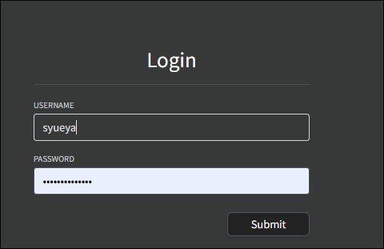

## 安装

### 1、下载镜像

在绿联云镜像仓库里搜索audiobookshelf，下载最新版本。

### 2、创建容器

1、点击创建容器，名称可自定义，资源限制也可自定义设置，勾选创建后启动容器。

2、基础设置选择倒数第二项。

3、存储空间如下配置

4、本地端口随意，只要不冲突即可。

## 使用

1、浏览器输入IP:189即可进入注册界面，创建账号密码点击submit。

2、输入账号密码进行登录。

3、点击右上角的设置，选择简体中文

4、新建媒体库

5、扫描媒体库

6、完成扫描

