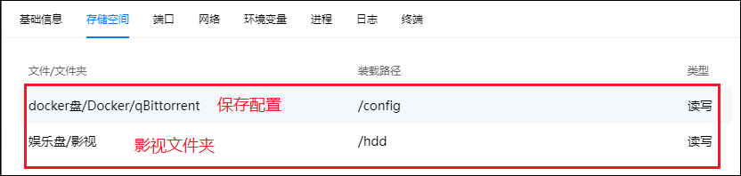

## 1、容器创建

1、首先登录绿联云APP，并在存储空间docker目录下新建个qBittorrent文件夹来存储配置文件。

2、登录绿联云APP，打开docker在镜像管理，在镜像仓库中搜索qbittorrent，点击下载版本选择最新版本即可（latest）。

3、下载好后在本地镜像中找到已经下载好的镜像点击创建容器。

4、容器名称保持默认，因为qb在下载较多种子的时候对系统资源的占用比较高，所以我对qb的系统资源占用情况进行了限制，大家根据自身需求进行设置，然后点击下一步。

5、基础设置中重启策略选择最后一个容器退出时重启（不考虑在进程启...），网络和命令保持默认即可。

6、存储空间中，首先将第一步中创建qBittorrent目录装载给/config，用来存储qBittorrent的配置文件。然后把影视文件夹目录装载给hdd (这里hdd换成其它的名称也可以)。

7、端口设置中本地端口和容器端口保持一样就行，因为很多PT站封禁了6881端口，所以我们修改6881端口为16881端口。

8、环境中添加如下名称和值，然后点击下一步。
- PUID=0
- PGID=0
- TZ=Asia/Shanghai
- WEBUI_PORT=8080

9、再次检查配置选项是否正确，没有问题后点击完成。

10、然后点击启动容器，就可以看到qBittorrent显示运行中。

11、打开浏览器，在地址栏输入绿联IP:8080,就可以访问qb的webui页面了，输入初始的用户名（admin）和密码（adminadmin）登录。

## 2、初始化设置

>下面的设置项设置完成后，记得点击保存。

1、点击设置按钮，可以把语言设置为简体中文。

2、在web UI下可以修改账户名称和密码，建议修改。

3、如果下载没速度的话，可以点击一下随机端口，最好设置个5位数的端口。

4、如果同时下载数很多的话，则有些会显示排队的状态，我们可以取消勾选Torrent 排队来解决，也可以把默认的数值设置大一点。

5、确认“总是向同级的所有Tracker汇报”、“总是向所有等级的Tracker汇报”选中。

## 3、皮肤美化

官方介绍：<https://github.com/WDaan/VueTorrent>

1、VueTorrent压缩包下载：<https://github.com/WDaan/VueTorrent/releases>,下载最新版本的即可。注意：下载的是vuetorrent.zip这个压缩包而不是下面两个源码的。

2、在docker盘的qb目录（/config挂载对应的目录）下新建一个文件夹theme用来存放皮肤文件。

3、把下载的VueTorrent压缩包文件解压放进去。

4、然后打开qb，点开设置-Web UI里面，勾选使用备用Web UI，并选择路径。然后点击保存。

5、重启qb，进入已更换皮肤的web界面，点击右上角的齿轮进入设置界面，选择VUETORRENT，往下翻，设置语言为中文，右上角点击保存。然后重新刷新界面，就是中文界面了。

6、如果页面打不开，提示 xx 文件无效、找不到，那说明文件夹路径配置错误。

可以打开QB 配置文件（qBittorrent.conf，记事本等工具可以打开）。

然后找到 WebUI\RootFolder 行， 修改后面的值即可。

## 4、进阶

### 1、忘记密码

如果忘记了密码，可以打开QB 配置文件（qBittorrent.conf），删除 WebUI\Password_PBKDF2 这一行把密码重置为默认密码，再重启 QB 容器就可以了。

### 2、详细说明

在网上看到的一个详细说明，仅供参考

可实现下载完成通知、宕机通知、tracker出错超出阈值通知、自动分类、tracker出错打标签、批量修改tracker、检测指定文件夹下未在qbittorrent客户端中做种的文件夹/文件、配合IYUUAutoReseed实现自动重新校验和自动恢复做种、指定设备上线时自动限速、多时段限速、导出做种文件清单、导出未做种文件清单等等等等。

匿名模式说明：https://github.com/qbittorrent/qBittorrent/wiki/Anonymous-Mode

可用的备用WebUI清单见：https://github.com/qbittorrent/qBittorrent/wiki/List-of-known-alternate-WebUIs。

