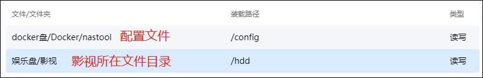
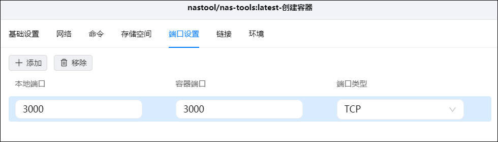
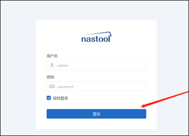
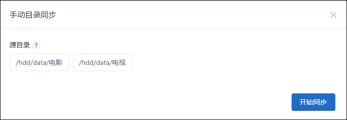
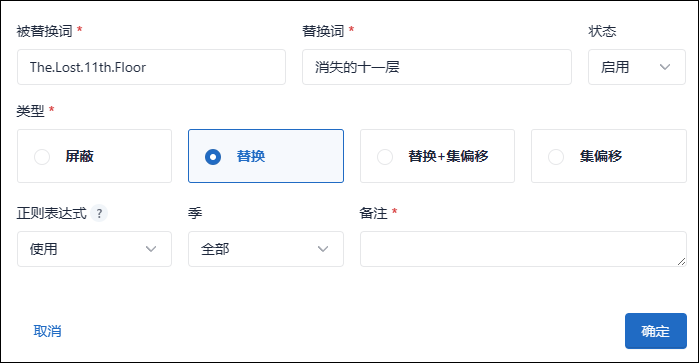
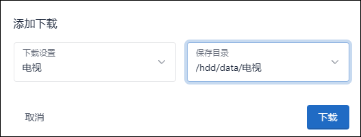
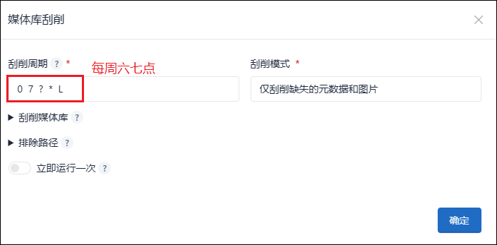

## 一、前期准备

### 1、申请TMDB的Api

1、点击进入[TMDB官网](https://www.themoviedb.org/)，点击【加入TMDB】。

2、按照要求输入相关信息完成注册。

3、注册完成以后会收到封验证邮件，点击ACTIVATE MY ACCOUNT激活账户。

4、登录TMDB。

5、点击右上角的头像-帐户设置。

6、点击左侧的API，然后点击请求API秘钥下面的 click here。

7、点击开发者（Developer）。

8、协议滑动到最后选择接受。

9、名称自定义，应用URL填写绿联IP，应用简介按照写api用途（最好填写英语，百度翻译即可）然后点击提交。

>应用简介参考（填写英文部分）：满足个性定制化需求，丰富网站接口以及功能（Meet personalized needs, enrich website interfaces and functions）。

10、这样我们就获取到了TMDB的API密钥，复制下来保存，后面我们会用到。

### 2、查看豆瓣ID

豆瓣ID编号方便将豆瓣账号中想看的电影或者剧集直接推送到NAS-TOOL工具，来实现下载。

登录豆瓣点击个人主页，地址栏的链接中的数字为豆瓣ID，复制这串ID并保存。

### 3、安装nastool容器

1）下载镜像

打开docker,搜索nastool，有两个版本，一个为2.91版本，一个版本为3.x。

我这里下载3.x版本，版本选择最新的（latest）。

2）创建容器

主要更改以下几个地方，其他的默认

- 基础设置中重启策略选择最后一个。

  

- 在docker盘新建一个nastool文件，映射给容器的/config用来存储nastool配置文件。
将下载目录文件映射给容器的/hhd，这个目录最好和qbitorrent里的设置一样。

  

- 3、端口设置中本地端口和容器端口都是3000。

  

- 4、环境中将自动更新开关NASTOOL_AUTO_UPDATE的true改为false。

  

- 5、创建完成后启动容器

  

### 4、初始化nastool媒体库

1）绿联ip+端口进入nastool页面，登录页面默认用户名是amdin，密码：password，点击登录。

2）登录成功以后首先需要配置TMDB API，和修改密码，我们点击确定，然后系统会自动进入基础设置配置页面。

3）填入TMDB API以后点击保存，这一步是必要的，因为nastool的所有媒体检索服务都要依托于TMDB的信息库。

4）接下来需要进行nastool的认证，默认没有认证的nastool页面如下。

5）点击左下角的用户认证，输入支持认证的PT站点账号和密码，点击认证。

## 二、文件目录讲解

nastool媒体库是一整套软件和容器的组合，其中目录相关配置在其中占据了百分之八十，可以这么说明白了目录配置，nastool的所有配置你就会了百分之八十。

这里为了考虑到新手用户我将对目录来做一个讲解，大家根据我的讲解来分析自己的目录应该怎么配置。

1、首先说一下我的绿联云存储空间情况，其中我有一块专门的16T的盘用来存储我的影视，音乐，电子书资源。

2、在娱乐盘中我建立了一个存放影视的目录【影视】，并且把这个目录映射给了nastool、qb等。
nastool容器目录映射

qbittorrent容器目录映射

3、我影视文件夹里设立了两个子文件夹：data、data_link，其中data和data_link文件夹里我各建了两个子文件夹：电影、电视。

如上面图片所示，如果我在容器nastool或者qbitorrent中想访问【娱乐盘/影视/电影】目录我应该访问【/hdd/电影】。

明白了上面的的目录映射关系我们就很容易完成下载器等目录的配置。

## 三、nastool详解

### 1、探索

探索中提供了豆瓣和TMDB的榜单等，点击相关影视下面的订阅按钮（一个爱心）后，媒体库在匹配到相关资源后会自动完成下载、信息刮削、添加到媒体库等操作。（需完成站点、下载器、媒体库配置）

### 2、资源搜索

可以在搜索框中输入想看的电影或者电视剧，然后可以将影视添加到订阅，在匹配到合适资源的时候会自动下载，并且添加到媒体库。（需完成站点、下载器、媒体库配置）

点进去可以搜索资源或者添加订阅。

搜索资源是在你添加的站点里查找看是否有匹配的资源，然后可以选择下载。

### 3、站点管理

**1、COOKIE获取**

进入PT站，保证是自己在登录状态下，按下F12，进入开发者模式，刷新下pt站，然后点击网络-文档。点开文档下的文件（一般第一个就是我们要的），找到cookie。

**2、站点添加**

在站点维护里点击新增站点

按照要求填写入相关信息，然后点击新增，有什么不懂的可以看对应的？号，说明很详细。

Ps：RSS地址获取,不选默认全勾选：

站点添加以后点击站点测试可以看各站点网络连接情况。

**3、数据统计**

数据统计可以看到各个站点的上传和下载情况

**4、站点资源**

点击站点可以看到站点的资源列表，也可以在这里进行下载。

**5、刷流任务**

点击右上角可以新增任务。

可以按要求填写相关信息，如果不懂的可以看后面的？。

### 4、订阅管理

在探索和搜索中订阅的电影、电视剧可以在此处查看到，nastool会每天在相关的站点检索相关资源，有适合的资源自动下载整理，当订阅的资源下载完成以后，会自动删除相关订阅任务。

完成下载器等配置后要设置订阅设置，否则订阅下载将会出现问题。

### 5、下载管理

正在下载和近期下载看名字就知道含义。就是个统计界面。

自动删种中我们可以设置一些任务，当种子达到某些条件的时候进行删除，相关条件说明查看请点击？。

### 6、媒体整理

**1、文件管理**

可以对文件夹里的文件进行单独/批量的转移，也就是手动刮削。

填写相关设置

**2、手动识别**

某些资源因为名称或者网络问题无法识别的时候会出现在这里。可以重新进行识别。

比如消失的11层的第5集识别不了，我们选择手动识别，填写相关信息，点击转移。

处理成功

手动识别里没有这个文件了

历史记录里多了条

**3、历史记录**

这是我们处理成功的一些记录，也可以在这里进行一些操作。

**4、TMDB缓存**

可以对TMDB缓存进行修改和删除

### 7、服务

服务模块是各种服务的启动开关，有些是自动启动的，有些需要手动启动。

1）点击目录同步，选择目录，点击开始同步，就会开始执行同步任务。

2）使用网络联通性测试可以快速帮助我们检测到网络是否正常，如果出现如下问题第一步考虑网络连通性。

### 8、设置模块

**1、基础设置**

1）系统

可以对账号和密码进行修改，也可以修改日志级别为DEBUG，方便查看错误原因。修改后记得点击保存按钮。

点击右上角头像，可以查看实时日志，有问题询问其他大佬建议带上日志截图。

2）媒体

必须配置的选项为TMDB的API在之前我们已经配置好了。

其他的可以动下面这些，推荐刮削设置全选，然后选上刮削元数据及图片。

电影电视的重命名这里可以看`？`后面的说明，具体说明每个符号代表的意思，注意，中间一定要有个/，/前面是影视所在文件夹名称的命名，/后面是影视文件的命名。如果没有/只有一个命名规则，则识别不出文件，硬链接后文件夹里没有文件。

3）其他

剩下的没啥，一般默认，只有服务下的这几项任务时间设置可以按自己的需求来更改。

**2、媒体库**

媒体库目录为硬链接后的目录，也是emby、jellyfin、plxe等的媒体路径。

**3、目录同步**

在右上方可以新增目录同步，源目录选择tr和qb的下载目录，目的目录是硬链接后的目录，同步方式选择硬链接。

设置好目录同步后，可以点击服务-目录同步，然后勾选需要同步的文件夹开始同步。

**4、消息通知**

可选择的消息通知类型很多，这里以pushplus为例。

打开[pushplus官网](http://pushplus.plus/)，点击登录，并用微信扫码登录

选择【发送消息】--【一对一消息】获取token

复制Token：

在设置-消息通知里新增消息通知，选择pushplus，填写名称和pushplus的Token：

完成设置：

**5、过滤规则**

在日常订阅一些电影的时候，往往站点提供了多种字幕清晰度的视频，过滤规则可以很好的帮助我们确定优先下载哪种清晰度的资源。

默认提供了两种规则，将我们想使用的规则的星号带上标记即可。一般选择日常观影就够了。
也可以创建自己的规则。

**6、自定义识别词**

自定义识别词多用来修改未能识别的电影电视剧名称，从而提高媒体库识别率。

我们进入页面可以看到有一个默认的识别词组【通用】，在右边点击+可以新增识别词。

新增识别词界面可以先选择不同的类型，有屏蔽、替换、替换+集偏移、集偏移，然后在类型上面填写相应的信息，类型下方的正则表达式自定义填写。

然后在在右上角我们也可以新增些识别词组。

比如我们有部电视消失的11层最近更新了两集，但是由于下载的文件文件名比较复杂，所以识别不了。

所以我们先在TMDB里查找对应的ID

然后新建个消失的十一层楼的识别词组。

然后新建个识别词把文件名【The.Lost.11th.Floor.2023.E08.WEB-DL.4K.H265.DDP.AAC-HDCTV.mp4】里的前部分替换一下。

结果如图。

这时我们去媒体整理-文件管理里可以点击识别，发现可以识别了。

再去媒体整理-手动识别里把刚刚失败的重新处理一下，发现成功了。

**7、索引器**

注意：3.x以及更新版本的nastool将不再支持bt。

并且只有选中的PT站才会在搜索中使用。

**8、下载器**

1、新增下载器

在右上方可以选择新增下载器。

- 下载器名称自定义个
- 状态设置为启用
- 类型选择qb
- 依次输入地址、端口、用户名、密码。
- 转移方式一般是硬链接
- 下载目录设置可以参考我的
- 填写完后点击测试，显示测试成功以后再点击确定保存。

有transmission的也是差不多的设置。

成功添加了下载器后，可以点击小星星将下载器设置成默认。

2、下载设置

下载设置可以对qb或者tr添加规则，来满足不同的下载需求，在我们搜索或者订阅电影的时候可以应用此选项。

右上方可以新增下载设置。

名称自定义，下载器选择qb或者tr，动作默认，分类（仅限于Qbitorrent）自定义，标签可填可不填，其他的自己一般选择默认。

比如我的设置

如果下载的时候我选择电视。

那qb里分类也就会给我打上电视。

**9、媒体服务器**

以emby为例，其他的类似。

1）登录emby服务器,点击右上角的设置-API密钥-新API密钥。

2）名称自定义，然后复制密钥，注意不要复制后面的名称。

3）回到nastool，点击设置-媒体服务器，选择emby服务器，将emby的局域网访问地址（ip+端口）和api密钥填入对应选项框中，然后点击测试，出现测试成功以后点击确定。

**10、插件**

在新版本的nastool中很多功能不再集成，大家可以根据自己的需求可以在插件市场安装插件来丰富nastool的功能。

在这里我介绍下几个常用的插件。

1、媒体库刮削

刮削周期可以点击`？`查看说明，用得是cron表达式：

2、站点自动签到

对自己的站点进行自动签到。

3、刷新媒体库

4、chinesesubfinder字幕下载

需额外配置chinesesubfinder容器。

5、自动备份

