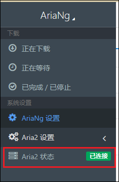
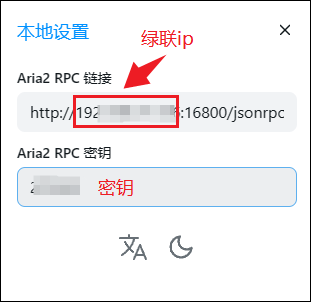
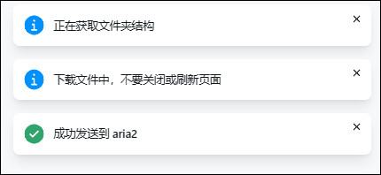

## 1.Aira2容器部署

1、在镜像仓库查找并下载superng6/aria2最新版镜像。

2、点击创建容器

3、基础设置里重启策略设置为容器退出时总是重启容器(这样在设备重启或者开机下会自动打开Aira2)

4、存储空间设置，需要在你存放Docker的硬盘中创建一个Aria2文件，并创建两个子文件夹分别为www和config，在你的下载盘中设置一个download/aria2文件夹。装在路径默认，类型全部读写。

5、端口设置，因为绿联内置离线下载使用了6800端口，需要把本地端口修改6800以外的未被占用的端口如我这里设置的16800。这个16800端口需记住，是我们的Aira2的链接端口，后续图形化面板和Alist都用的到。

6、到达环境往下翻可以看到一个SECRET这里是你的密钥设置你可以设置成自己记得住的密钥，后续要用。

7、然后我们点击下一步，再点击完成aria2容器部署。

## 2.ariang容器部署

1、在镜像仓库界面查找并下载p3terx/ariang最新版镜像

2、点击创建容器

3、基础设置里重启策略设置为容器退出时总是重启容器(这样在设备重启或者开机下会自动打开ariang)

4、跳过命令和存储空间，把端口设置为6880。

点击下一步然后点击完成，至此ariang容器部署完成。

## 3.ariang连接Aira2

1、打开浏览器输入你的绿联云IP+ariang端口进入ariang，这个时候出现个认证失败不要管。 在左侧设置栏进入AriaNG设置，输入你的Aira2的端口号16800以及密钥。然后点击重新加载AiraNG

2、这样我们就可以看到我们的状态就是已经连接的状态了

## 4.Ailst连接Aira2

1、登录Alist界面点击本地设置

2、填写你设置的Aira2的ip和端口以及密钥

3、然后打开复选框

4、然后就可以选中我们需要的文件，点击下方下载图标，有一个发送到Aira2，点击发送。

5、右上角会弹出弹窗已经成功发送到aria2。

6、我们回到AiraNG界面可以看到下载进度。

7、在我们上面Aria2存储空间配置的下载文件夹中可以看到我们下载成功的文件。

