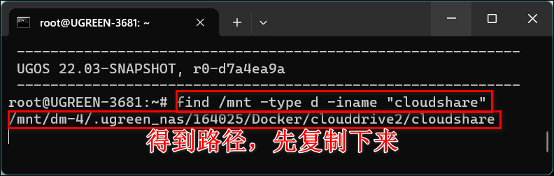

## 容器部署

1、在docker文件夹下创建一个clouddrive2文件夹，并在其下面再创建两个子文件夹：cloudshare和Config。


2、绿联-设备管理-调试功能里打开远程调试功能，有个验证码，后面有个复制按钮，可以点击复制。


3、如果是win系统的话，按win+R键输入cmd，进入命令提示符窗口，然后在终端输入命令 `ssh -p 922 root@绿联的ip`，注意ip是绿联使用ipv4 ip。比如我的绿联ip是192.168.1.6，则我输入的命令是`ssh -p 922 root@192.168.1.6`。

中间有个叫你确认的地方，直接输入yes即可。然后会让你输入密码，即在这里输入刚刚在绿联客户端拿到的验证码（在绿联点击复制后，在这里鼠标右击即为粘贴），注意这里的输入是不会显示的，请一次输入正确然后回车。


4、然后我们输入以下命令：

```yaml
find /mnt -type d -iname "cloudshare"
```
找到刚创建的cloudshare目录的绝对路径，也就是：`/mnt/dm-4/.ugreen_nas/164025/Docker/clouddrive2/cloudshare`。**注意：先将这个路径先复制下来备用。**



5、然后输入以下两个命令

```yaml
cd /etc/init.d # 进入到init.d目录
vi mountshare # 创建一个脚本文件并编辑
```


6、英文环境下点击键盘i进入编辑模式，复制以下内容，右键粘贴到刚才的命令行窗口中，点击esc退出编辑模式。

>注意：下面的命令中的两个dm-4是上面找到的cloudshare路径`/mnt/dm-4/.ugreen_nas/164025/Docker/clouddrive2/cloudshare`中/mnt/后的内容，你的可能不一样，比如会是dm-2之类的，记得改成自己的

```yaml
#!/bin/sh /etc/rc.common
START=99
start(){
       for num in $(seq 1 60); do
          if [ "$(mount | grep -c /dev/dm-4)" -gt 0 ]; then
                break
          fi
          sleep 1
          done
          mount --make-shared /mnt/dm-4
          echo "myscript is start"
}

stop(){
       echo "myscript is stop"
}
restart(){
        echo "myscript is restart"
}
```


然后在键盘英文环境下输入：

```yaml
:wq # 保存并退出文件
```


7、接下来输入以下两个命令

```yaml
chmod +x mountshare # 给刚才的脚本添加执行权限
./mountshare enable # 应用脚本并添加开机启动
```


8、执行完后，输入`reboot`命令，重启nas。注意：如果有正在执行的传输任务等，记得等传输结束后再执行下面的命令。


或者你可以到nas的客户端中执行重启操作


9、重启完后，重新连接到命令行，输入以下docker run命令然后按回车键。

命令中我们需要替换三个东西：

- 第一个是-p 19798:19798，冒号前的数字需要替换成本地没有占用的端口，一般来说不用动
- 第二个是`/mnt/dm-4/.ugreen_nas/78978/docker/clouddrive2/cloudshare`这个路径替换成我们上面找到的cloudshare路径
- 第三个是把`/mnt/dm-4/.ugreen_nas/78978/docker/clouddrive2/Config`替换成我们上面找到的cloudshare路径的cloudshare改成Config后的路径

```yaml
docker run -d --name clouddrive2 --privileged=true --restart=always --device /dev/fuse:/dev/fuse -v /mnt/dm-4/.ugreen_nas/78978/docker/clouddrive2/cloudshare/:/cloudshare:shared -v /mnt/dm-4/.ugreen_nas/78978/docker/clouddrive2/Config:/Config -p 19798:19798 -e TZ=Asia/Shanghai -e CLOUDDRIVE_HOME=/Config cloudnas/clouddrive2-unstable:latest

```

第一次执行会拉取镜像，时间可能会比较长，大家耐心等待下，当出现图中类似的字符串之后，就表示容器已经创建成功了。


## 使用

1、接下来浏览器输入ip:19798（如果没改端口号的话）进入clouddrive2，首次打开需要点击注册来注册一个账号。


2、注册完成后点击登录


3、clouddrive2支持115、天翼云盘、阿里云盘、百度网盘等云盘，并且支持挂载webdav。想挂载哪个云盘就点击对应的网盘图标即可，会有挂载指引，比如阿里只需要扫码登录下。注意：免费版本挂载数量有限制，比如只能最大2个云盘数和最大1个挂载数。


4、我们可以使用alist的webdav链接实现多网盘的本地挂载：点击添加网盘，选择webdav，服务器输入http://ip:alist的端口/dav，用户名密码就是alist登录的用户名密码。


5、在左边点击挂载alist的webdav，然后点击电脑样式的挂载到本地按钮添加挂载点，挂载点选择我们创建的cloudshare目录，然后点击挂载。


6、现在我们本地docker目录中的cloudshare文件夹已经有了我们alist挂载的网盘了，我们就可以在绿联云影院等地方创建媒体库并选择我们云盘路径了。


7、因为免费的只能一个挂载数，所以如果我们想另外挂载个的话，得先删除刚刚挂载的。方法：点击左上角的挂载管理图标，卸载删除已挂载的webdave


