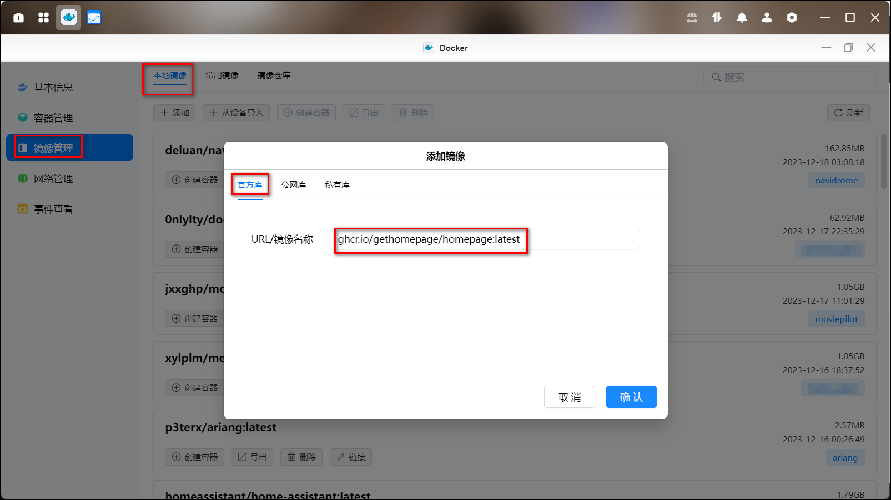
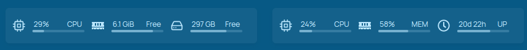
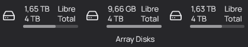

## 一、容器部署

### 下载容器

进入docker，点击镜像管理-本地镜像-添加-私有库（注意是私有库，这个镜像未发布在Docker Hub），URL地址处输入：ghcr.io/gethomepage/homepage:latest，下载最新版镜像。



### 创建容器

1、安装教程：<https://gethomepage.dev/v0.8.3/installation/docker/>

```yaml
version: "3.3"
services:
  homepage:
    image: ghcr.io/gethomepage/homepage:latest
    container_name: homepage
    ports:
      - 3000:3000
    volumes:
      - /path/to/config:/app/config # Make sure your local config directory exists
      - /var/run/docker.sock:/var/run/docker.sock # (optional) For docker integrations

```

2、下载完后创建容器，名称默认即可，也可自定义，勾选创建后启动容器，点击下一步。


3、基础设置里选择倒数第二项


4、存储空间设置

- 在docker盘新建个homepage文件夹，并在这个文件夹里新建个config子文件夹，然后在存储空间里挂载为/app/config，注意类型为读写。
- 如果你想用本地存放的logo的话，你可以新建个文件夹logos，挂载为/app/public/icons。
- 如果你需要显示某个的盘容量信息的话，需要把这个盘也挂载上，可以自定义命名。


5、本地端口随便设置个未被占用的。


6、设置完成后点击完成，在浏览器输入绿联的IP:3999（刚刚设置的本地端口），进入homepage页面。


### 使用环境变量来存储敏感信息

你还可以在配置文件中使用环境变量来保护敏感信息。请注意以下事项：

- 环境变量必须以 `HOMEPAGE_VAR_` 或 `HOMEPAGE_FILE_`开头。
- 环境变量 `HOMEPAGE_VAR_XXX` 的值将替换配置文件中的`{{HOMEPAGE_VAR_XXX}}`。
- 环境变量 `HOMEPAGE_FILE_XXX` 的值必须是一个文件路径，文件内容将替换配置文件中的`\{{HOMEPAGE_FILE_XXX}}`。

比如：
- 配置文件内容：

   ```yaml
   username: {{HOMEPAGE_VAR_QB_USERNAME}}
   password: {{HOMEPAGE_VAR_QB_PASSWORD}}
   config_file: {{HOMEPAGE_FILE_DB_CONFIG}}
   ```

- 设置对应的环境变量：
   
   ```bash
   export HOMEPAGE_VAR_QB_USERNAME=myusername
   export HOMEPAGE_VAR_QB_PASSWORD=mypassword
   export HOMEPAGE_FILE_DB_CONFIG=/path/to/db_config.ini
   ```

在上面的示例中，\{{HOMEPAGE_VAR_XXX}} 和 \`{{HOMEPAGE_FILE_XXX}}` 将分别被环境变量 `HOMEPAGE_VAR_XXX` 和 `HOMEPAGE_FILE_XXX` 的值所替换。这种方式可以确保敏感信息不会直接出现在配置文件中，而是通过环境变量进行传递。


## 二、配置文件说明

官方说明文档：https://gethomepage.dev/v0.7.3/configs。

我们进入docker盘中刚刚新建的homepage-config文件夹，可以看到有好几个yaml格式的文件夹。


注意：
- yaml格式的不建议用记事本打开直接编辑，一定要用编辑器修改，比如vscode或pycharm。
- 或者使用在线编辑器（<https://codebeautify.org/yaml-validator>或<https://jsonformatter.org/yaml-validator>）编辑。


其中：
- settings.yaml：包含了与应用程序相关的配置，比如背景图片、默认主题颜色等。
- bookmarks.yaml：它通常包含每个网站的URL（网址）和名称，你可以通过修改这个文件来管理你个人的网站收藏。
- services.yaml：用于配置部署在主页上的一些服务。它通常包含服务的名称、URL，以及访问和使用每个服务所需的其他设置或参数。
- widgets.yaml：包含了信息小部件的配置设置，它们会显示在主页上。小部件是一些提供实用信息或功能的小组件，比如天气、日历、待办事项列表、新闻等。你可以自定义这个文件，来指定每个小部件在主页上的类型、位置和设置
- kubernetes.yaml：通常用于配置Kubernetes集群。它包含了定义和管理Kubernetes资源的规范和设置，如部署、Pod定义、服务等。
- docker.yaml：用于配置Docker实例。它包含了Docker容器的名称、镜像名称、端口映射、环境变量等设置。你可以定义和管理运行在你的系统上的各种Docker容器。
- custom.css & custom.js： 用于自定义主页的CSS（层叠样式表）和JavaScript。custom.css允许你指定自己的样式，修改主页的外观和布局，而custom.js允许你添加自定义的JavaScript代码，实现特定的行为或页面交互。


## 三、settings.yaml

### 1、网页标题

设置网页标题。

```yaml
title: 山月的导航
```

### 2、语言

设置想要的语言

```yaml
language: zh-CN # 中文
```

当前支持的语言：: ca, de, en, es, fr, he, hr, hu, it, nb-NO, nl, pt, ru, sv, vi, zh-CN, zh-Hant 。

你也可以使用DateTime widget这样的样式：en-AU, en-GB, etc。

### 3、页眉样式

目前有4个页眉样式选项。

```yaml
headerStyle: underlined # 默认
```


```yaml
headerStyle: boxed
```


```yaml
headerStyle: clean
```


```yaml
headerStyle: boxedWidgets
```




### 4、图标

如果你想使用自定义的网站图标而不是默认提供的图标：你可以提供一个完整的 URL 来指向选择的图像，或者提供相对于 /app/public 目录的本地图像的路径。

```yaml
favicon: https://www.google.com/favicon.ico 
# 或 
# favicon: /icons/homepage.png
```

### 5、主题

可以通过传递 theme 选项来配置固定的主题（并禁用主题切换器），如下所示：

```yaml
theme: dark # or light
```

### 6、颜色调色板

可以通过传递 color 选项来配置固定的颜色调色板（并禁用调色板切换器），如下所示：

```yaml
color: slate
```

>支持的颜色有：板岩`slate`、灰色`gray`、锌色`zinc`、中性色`neutral`、石头色`stone`、琥珀色`amber`、黄色`yellow`、青柠色`lime`、绿色`green`、祖母绿`emerald`、鸭绿色`teal`、鸭绿色`cyan`、天空色`sky`、蓝色`blue`、靛蓝色`indigo`、紫色`violet`、紫色`purple`、紫红色`fuchsia`、粉红色`pink`、玫瑰色`rose`、红色`red`、白色`white`


### 7、Homepage版本

默认情况下，发布版本显示在页面底部。要隐藏此项，可以使用隐藏版本设置：

```yaml
hideVersion: true
```

### 8、日志路径

默认情况下，主页日志文件被写入config/logs子目录，你可以通过设置logpath自定义日志路径。

```yaml
logpath: /logfile/path
```

### 9、布局

如果你在 services.yaml 或 bookmarks.yaml 文件中有一个名为 Media 的组，您可以使用以下方式将 服务和书签 部分配置为基于 "column" 或 "row" 的布局，其中将"row" 可以水平排列服务或书签，而"column" 则可以垂直排列它们。

```yaml
layout:
  Media:
    style: row
    columns: 4
```

这将产生以下布局：


**1）增加第五列**

默认情况下主页列样式最多为4列，但你可以通过添加以下内容来添加第五列：

```yaml
fiveColumns: true
```

**2）可折叠**

默认情况下服务和书签的可折叠功能是处于启用状态的，可以通过添加以下内容禁用此功能。

```yaml
disableCollapse: true
```

**3）排序**

服务组和书签组可以按照需求混合排列，**但必须使用不同的组名**。如果没指定任何书签组，它们将显示在页面底部。

>如果为服务组和书签组使用相同的名称，可能会导致意外的行为，例如书签组被隐藏。

组将根据布局块中的顺序进行排序，你也可以混合使用由 Docker 标签定义的组，例如：

```yaml
layout:
  - Auto-Discovered1:
  - Configured1:
  - Configured2:
  - Auto-Discovered2:
  - Configured3:
      style: row
      columns: 3
```

**4）标题**

可以通过将 header 设置为 false 来隐藏布局中每个部分的标题：

```yaml
layout:
  Section A:
    header: false
  Section B:
    style: row
    columns: 3
    header: false
```

**5）类别图标**

可以为类别（或菜单项）添加一个图标。

```yaml
  Home Management & Info:
    icon: /icons/video.png
  Server Tools:
    icon: https://cdn-icons-png.flaticon.com/512/252/252035.png
```

**6）图标样式**

默认的图标样式是渐变效果，但你可以通过指定一个"flat"（扁平）样式来与主题相匹配。

“flat”样式：前缀图标将呈现简洁、扁平化的外观，没有渐变效果。

```yaml
iconStyle: theme # optional, 默认 gradient
```

**7）选项卡**

只有在至少一个布局组上设置了选项卡字段时，选项卡才会生效。

选项卡的排序基于布局块中的顺序。如果一个组没有指定选项卡（而其他组设置了选项卡），服务和书签将显示在所有选项卡上。

可以通过在主页URL的末尾加上＃Group（小写并进行URI编码）来直接访问每个选项卡。

例如，以下配置将创建四个选项卡：

```yaml
layout:
  ...
  Bookmark Group on First Tab:
    tab: First

  First Service Group:
    tab: First
    style: row
    columns: 4

  Second Service Group:
    tab: Second
    columns: 4

  Third Service Group:
    tab: Third
    style: row

  Bookmark Group on Fourth Tab:
    tab: Fourth

  Service Group on every Tab:
    style: row
    columns: 4
```

### 10、背景图像

>注意： 由于Next.js静态站点服务器的限制，在添加新图像之后，要重启容器以更新静态文件，并使新图像对客户端可用。 创建绑定挂载（bind mount）时，避免将整个/app/public/目录进行绑定挂载。

如果你想使用背景图片而不是纯色主题，那你需要提供你选择的图片的完整URL。

```yaml
background: https://images.unsplash.com/photo-1502790671504-542ad42d5189?auto=format&fit=crop&w=2560&q=80
```

或者可以通过在Docker Compose文件中挂载一个保存图像的路径/app/public/images，然后将路径挂载到存放图片的本地目录。

```yaml
volumes:
  - /my/homepage/images:/app/public/images
```

然后使用相对路径来指定本地图片。

```yaml
background: /images/background.png
```

**背景透明度 & 滤镜**

您可以指定应用于背景图像的滤镜，包括模糊度、饱和度、亮度以及透明度与背景颜色的混合。前三个滤镜设置使用Tailwind CSS类，有关每个选项的说明，请参阅下面的注释。您不需要指定所有选项。

```yaml
background:
  image: /images/background.png
  blur: sm # 模糊度：sm, "", md, xl... see https://tailwindcss.com/docs/backdrop-blur
  saturate: 50 # 饱和度：0, 50, 100... see https://tailwindcss.com/docs/backdrop-saturate
  brightness: 50 # 亮度：0, 50, 75... see https://tailwindcss.com/docs/backdrop-brightness
  opacity: 50 # 透明度： 0-100
```

**卡片背景模糊**

您可以为 服务卡片service & 书签卡片bookmark 应用模糊滤镜。请注意，此选项与背景模糊、饱和度和亮度滤镜不兼容。

```yaml
cardBlur: sm # sm, "", md, etc... see https://tailwindcss.com/docs/backdrop-blur
```

### 11、快速启动

可以使用“快速启动”功能搜索服务、执行web搜索或打开URL。要使用快速启动，只需在主页上输入即可（只要搜索小部件没有焦点）。

 

快速启动功能有一些可选设置：

```yaml
quicklaunch:
  searchDescriptions: true # （搜索描述）：控制搜索中是否包含项目描述。默认情况下，此选项处于禁用状态。当启用时，搜索结果会优先显示与项目名称匹配的项目，然后显示仅与描述匹配的项目。
  hideInternetSearch: false # （隐藏网页搜索）：禁止自动将当前网页搜索（例如来自小部件）作为快速启动选项之一。默认情况下为false，启用该功能。
  hideVisitURL: false # （隐藏访问链接）：禁用检测并提供打开URL的选项。默认情况下为false，启用该功能。
```

### 12、Start URL

可以通过自定义"start_url"来灵活控制可安装应用程序的初始加载行为，并确保用户在打开应用程序时可以直接进入所需的页面或功能。默认值为"/"（根目录）。

```yaml
startUrl: https://custom.url
```

### 13、基本URL地址

在某些代理配置中，可能需要设置文档的基本URL。您可以通过提供一个base值来实现这一点，例如：

```yaml
base: http://host.local/homepage
```

>URL必须是完整的、绝对的URL，否则浏览器将忽略它。

### 14、链接目标

链接目标用于指定链接的打开方式，以下是常用的链接目标选项：
- _self：在同一选项卡中打开链接。
- _blank：在新选项卡中打开链接。
- _top：在新窗口中打开链接。

```yaml
target: _blank # 可选项有： _blank, _self, and _top
```

这也可以针对个别服务进行设置。请注意，在服务级别设置此项会覆盖settings.json中的任何设置。

### 15、天气组件

"providers"允许您定义共享的API提供程序选项和密钥。 目前，这使你可以私密的定义天气API密钥，并且还用于定义Longhorn URL和凭据的位置。

```yaml
providers:
  openweathermap: openweathermapapikey
  weatherapi: weatherapiapikey
  longhorn:
    url: https://longhorn.example.com
    username: admin
    password: LonghornPassword
```

然后，可以在小部件配置中传递 API 提供商而不是直接传递 API 密钥。

```yaml
- weather:
    latitude: 50.449684
    longitude: 30.525026
    provider: weatherapi
```

### 16、显示Docker状态

您可以在settings.yaml中显示所有扩展的docker统计信息：

```yaml
showStats: true
```

或在每个服务（services.yaml文件）中设置：

```yaml
- Example Service:
    ...
    showStats: true
```

如果您同时设置了两个，则按服务设置优先。

### 17、状态样式

您可以从以下样式中选择docker或k8s的状态和 ping 风格：: `dot` or `basic`

- 默认情况下，Ping 响应时间以毫秒 (ms) 显示，而 Docker 或 Kubernetes 容器状态则显示为无值。
- `dot` （点）：对于成功的 Ping 或正常的状态，会显示一个绿色的点。
- `basic`（基础）：Ping 结果会显示为 "UP"（正常）或 "DOWN"（故障）。

For example:

```yaml
statusStyle: 'dot'
```
或在每个服务（services.yaml文件）中设置：

```yaml
- Example Service:
    ...
    statusStyle: 'dot'
```

如果您同时设置了两个，则按服务设置优先。

### 18、隐藏小工具错误消息

在settings.yaml中全局隐藏可见的API错误消息：

```yaml
hideErrors: true
```

或在每个服务部件（services.yaml文件）中设置：

```yaml
- Example Service:
    ...
    widget:
    ...
        hideErrors: true
```

如果其中一个值设置为true，则错误消息将被隐藏。


## 四、services.yaml

服务是在Services.yaml文件中配置的。您可以拥有任意数量的分组，并且每个分组可以包含任意数量的服务。

### 1、分组

分组被定义为顶级数组项。

```yaml
- Group A:
    - Service A:
        href: http://localhost/

- Group B:
    - Service B:
        href: http://localhost/
```


### 2、服务

服务被定义为分组上的数组条目

```yaml
- Group A:
    - Service A:
        href: http://localhost/

    - Service B:
        href: http://localhost/

    - Service C:
        href: http://localhost/

- Group B:
    - Service D:
        href: http://localhost/
```


### 3、描述

服务可以有描述

```yaml
- Group A:
    - Service A:
        href: http://localhost/
        description: This is my service

- Group B:
    - Service B:
        href: http://localhost/
        description: This is another service
```


### 4、图标

- 服务可能在[Dashboard Icons](https://github.com/walkxcode/dashboard-icons)中匹配有图标，你可以通过传递图标的名称来匹配，如果使用png版本可以带也可以不带`.png` ，svg版本的得带`.svg` 。

- 可以使用`mdi-XX`来匹配使用 [Material Design Icons](https://materialdesignicons.com) 中的图标 或 使用`si-XX`使用[Simple Icons](https://simpleicons.org/)中的图标。 可以通过添加十六进制颜色代码作为后缀来自定义颜色，例如mdi XX-#f0d453或si XX-#a712a2。

- 可以使用远程图标，请使用绝对 URL（例如 https://...）。

- 可以使用本地图标，首先创建一个 Docker目录 挂载到 /app/public/icons，然后将图标引用为 /icons/myicon.png。当添加新图标时，您需要重新启动容器。


```yaml
- Group A:
    - Sonarr:
        icon: sonarr.png
        href: http://sonarr.host/
        description: Series management

- Group B:
    - Radarr:
        icon: radarr.png
        href: http://radarr.host/
        description: Movie management

- Group C:
    - Service:
        icon: mdi-flask-outline
        href: http://service.host/
        description: My cool service
```


### 5、Ping

服务可能有一个可选的 ping 属性，允许你监视你选择的端点的可用性并显示响应时间。你不需要将 ping URL 设置为 href URL。

注意：ping 功能通过向 URL 发送一个 HTTP HEAD 请求来工作，如果失败，则会回退到 GET 请求。例如，如果 URL 需要身份验证或在 Authelia 后面等，则 ping 功能不会执行登录操作。在使用反向代理和/或身份验证的情况下，通常需要使用“内部”URL 来正确显示 ping 功能的状态。

```yaml
- Group A:
    - Sonarr:
        icon: sonarr.png
        href: http://sonarr.host/
        ping: http://sonarr.host/

- Group B:
    - Radarr:
        icon: radarr.png
        href: http://radarr.host/
        ping: http://some.other.host/
```

你还可以通过使用 statusStyle 属性为 ping 指示器应用不同的样式，详见 [settings](settings.md#status-style).

### 6、Docker集成

服务可以连接到Docker容器，可以在本地机器上运行，也可以在远程机器上运行。

```yaml
- Group A:
    - Service A:
        href: http://localhost/
        description: This is my service
        server: my-server
        container: my-container

- Group B:
    - Service B:
        href: http://localhost/
        description: This is another service
        server: other-server
        container: other-container
```

**在启用了 Docker 集成的服务中，单击状态标签将展开容器统计信息，您可以在那里查看 CPU、内存和网络活动。**

注意：这也可以通过`showStats`进行控制。有关更多信息，请参阅[show docker stats](docker.md#show-docker-stats)。


### 7、服务集成

服务还可以附带一个服务小部件（或集成），该小部件独立于 Docker 集成工作。

您可以在 [Service Widgets](service-widgets.md) 页面上找到每个支持的集成的信息和配置。

这是一个 Radarr 和 Sonarr 服务的示例，以及它们各自的集成。

```yaml
- Group A:
    - Sonarr:
        icon: sonarr.png
        href: http://sonarr.host/
        description: Series management
        widget:
          type: sonarr
          url: http://sonarr.host
          key: apikeyapikeyapikeyapikeyapikey

- Group B:
    - Radarr:
        icon: radarr.png
        href: http://radarr.host/
        description: Movie management
        widget:
          type: radarr
          url: http://radarr.host
          key: apikeyapikeyapikeyapikeyapikey
```


### 8、服务小部件

除非另有说明，否则URL不应以/或其他API路径结尾。每个小部件都会自行处理路径。

每个服务都可以附加一个小部件（通常与服务类型相匹配，但不强制要求）。

除了服务的 href 之外，您还可以指定打开该链接的目标位置。有关详细信息，请参阅 [Link Target](settings.md#link-target) 。

以Emby为例，以下是如何附加 Emby 服务小部件的示例。


```yaml
- Emby:
      icon: emby.png
      href: http://emby.host.or.ip/
      description: Movies & TV Shows
      widget:
          type: emby
          url: http://emby.host.or.ip
          key: apikeyapikeyapikeyapikeyapikey
```

**字段可见性**

每个小部件可以选择性地提供一个字段列表，指定哪些字段应该通过 fields 小部件属性可见。如果未指定字段，则将显示所有字段。fields 属性必须是有效的 YAML 字符串数组。以下是 Sonarr 的示例条目，仅显示了几个字段。

**在任何情况下，如果没有指定 fields 属性，小部件将正常工作并显示所有字段。**

```yaml
- Sonarr:
      icon: sonarr.png
      href: http://sonarr.host.or.ip
      widget:
          type: sonarr
          fields: ["wanted", "queued"]
          url: http://sonarr.host.or.ip
          key: apikeyapikeyapikeyapikeyapikey
```


## 五、widgets.yaml

Homepage有两种类型的小部件：info（信息）和service（服务）。下面我们将介绍每种类型以及如何配置它们。

### 1、服务小部件

服务小部件用于显示服务（通常是Web服务或API）的状态。服务（及其小部件）在`services.yml`文件中定义。以下是一个示例：

```yaml
- Plex:
    icon: plex.png
    href: https://plex.my.host
    description: Watch movies and TV shows.
    server: localhost
    container: plex
    widget:
      type: tautulli
      url: http://172.16.1.1:8181
      key: aabbccddeeffgghhiijjkkllmmnnoo
```

### 2、信息小部件

信息小部件用于在标题中显示信息，通常是关于您的系统或环境的信息。信息小部件在`widgets.yml`文件中定义。以下是一个示例：

```yaml
- openmeteo:
    label: Current
    latitude: 36.66
    longitude: -117.51
    cache: 5
```


## 六、bookmarks.yaml

书签功能与服务功能在分组和列表的工作方式上非常相似，只是它们更简单、更小，并且除了作为链接之外没有其他附加功能。

- abbr最好为两个字母，但不是强制性的。
- 也可以像服务图标的选项那样为书签使用图标。如果同时提供图标和缩写，图标将优先显示。
- 默认情况下，描述将使用链接的主机名，但您可以使用自定义描述来覆盖它。


```yaml
- Developer:
      - Github:
            - abbr: GH
              href: https://github.com/

- Social:
      - Reddit:
            - icon: reddit.png
              href: https://reddit.com/
              description: The front page of the internet

- Entertainment:
      - YouTube:
            - abbr: YT
              href: https://youtube.com/
```


## 七、常用服务小部件

###  1、qBittorrent

使用与web登录相同的用户名和密码。

允许的字段：[“leech 下载中”、“download 下载”、“seed 种子”、“upload 上传”]。

```yaml
widget:
    type: qbittorrent
    url: http://qbittorrent.host.or.ip
    username: username
    password: password
```

###  2、Transmission

使用与web登录相同的用户名和密码。

允许的字段：[“leech 下载中”、“download 下载”、“seed 种子”、“upload 上传”]。

```yaml
widget:
    type: transmission
    url: http://transmission.host.or.ip
    username: username
    password: password
    rpcUrl: /transmission/ # Optional. Matches the value of "rpc-url" in your Transmission's settings.json file
```


### 3、Emby

您可以在“设置Settings”>“高级Advanced”>“API密钥Api Keys”中从Emby内部创建API密钥

从v0.6.11开始，该小部件支持字段[“电影movies”、“系列series”、“剧集episodes”、“歌曲songs”]，这些块在默认情况下被禁用，但可以通过`enableBlocks`选项启用。“正在播放 ”功能（默认情况下启用）可以通过`enableNowPlaying`选项禁用。


```yaml
widget:
    type: emby
    url: http://emby.host.or.ip
    key: apikeyapikeyapikeyapikeyapikey
    enableBlocks: true # optional, defaults to false
    enableNowPlaying: true # optional, defaults to true
```

###  4、Jellyfin

您可以在“设置Settings”>“高级Advanced”>“API密钥Api Keys”中从Jellyfin内部创建API密钥

从v0.6.11开始，该小部件支持字段[“电影movies”、“系列series”、“剧集episodes”、“歌曲songs”]，这些块在默认情况下被禁用，但可以通过`enableBlocks`选项启用。“正在播放 ”功能（默认情况下启用）可以通过`enableNowPlaying`选项禁用。


```yaml
widget:
    type: jellyfin
    url: http://jellyfin.host.or.ip
    key: apikeyapikeyapikeyapikeyapikey
    enableBlocks: true # optional, defaults to false
    enableNowPlaying: true # optional, defaults to true
```

###  5、Plex

Plex的核心API在某种程度上有所限制，但支持有关库大小和活动流数量的基本信息。要获取有关活动流的更详细信息，请查看 [Plex Tautulli widget](plex-tautulli.md).

支持的字段: `["streams", "albums", "movies", "tv"]`.

```yaml
widget:
    type: plex
    url: http://plex.host.or.ip:32400
    key: mytokenhere # see https://www.plexopedia.com/plex-media-server/general/plex-token/
```

###  6、Jackett

Jackett在使用小部件时不能使用任何身份验证。

支持的字段: `["configured", "errored"]`.

```yaml
widget:
    type: jackett
    url: http://jackett.host.or.ip
```

###  7、Navidrome

token的值：由密码和salt的值组成的字符串的md5值

允许的字段：此小部件没有可配置的字段。


```yaml
widget:
    type: navidrome
    url: http://navidrome.host.or.ip:port
    user: username
    token: token #md5(password + salt)
    salt: randomsalt
```

###  8、Audiobookshelf

通过以管理员身份登录至 Audiobookshelf 网页应用程序，然后在 设置-用户 页面中找到你的账户并点击，就可以看到 API 令牌了。

允许的字段： `["podcasts", "podcastsDuration", "books", "booksDuration"]`。
- podcasts: 表示播客节目。
- podcastsDuration: 表示播客节目的持续时间。
- books: 表示有声书。
- booksDuration: 表示有声书的持续时间。

```yaml
widget:
    type: audiobookshelf
    url: http://audiobookshelf.host.or.ip:port
    key: audiobookshelflapikey
```

###  9、Nginx Proxy Manager

使用用于访问web UI的相同管理员用户名和密码登录。

允许的字段：[“enabled 已启用”、“disabled 已禁用”、“total 总计”]。


```yaml
widget:
    type: npm
    url: http://npm.host.or.ip
    username: admin_username
    password: admin_password
```

###  10、Tailscale

您需要从Tailscale仪表板的[密钥页面](https://login.tailscale.com/admin/settings/keys)生成一个API访问令牌。

要查找您的设备ID，请转到[machine overview page](https://login.tailscale.com/admin/machines)，然后选择您的机器。在“机器详情Machine Details”部分，复制您的`ID`。它将以`CNTRL`结尾。

允许的字段有: `["address", "last_seen", "expires"]`.

```yaml
widget:
    type: tailscale
    deviceid: deviceid
    key: tailscalekey
```

###  11、Home Assistant

您需要为现有的Home Assistant用户在其个人资料中生成一个长期有效的访问令牌。

允许的字段有：["people_home", "lights_on", "switches_on"]。

---

最多可以通过自定义属性查询四个自定义状态和/或模板，就像下面的示例一样。只要定义了fields属性，custom属性将不起作用。

-  `state`将查询指定`entity_id`的状态
    - 状态标签和值可以由用户定义，并且可以引用花括号中的实体属性
    - 如果未定义状态标签，将默认为`"{attributes.friendly_name}"`
    - 如果未定义状态值，将默认为`"{state} {attributes.unit_of_measurement}"`
-  `template`将查询指定的模板，请参阅[Home Assistant Templating](https://www.home-assistant.io/docs/configuration/templating)
    - 如果未定义模板标签，将为空


```yaml
widget:
    type: homeassistant
    url: http://homeassistant.host.or.ip:port
    key: access_token
    custom:
        - state: sensor.total_power
        - state: sensor.total_energy_today
          label: energy today
        - template: "{{ states.switch|selectattr('state','equalto','on')|list|length }}"
          label: switches on
        - state: weather.forecast_home
          label: wind speed
          value: "{attributes.wind_speed} {attributes.wind_speed_unit}"
```

## 八、信息小部件

### 1、Logo

可以显示homepage的logo。

```yaml
- logo:
    icon: /icons/homepage.png # 也可使用url来指向图像
```

### 2、Resources 资源信息

您可以选择包含所有或部分可用资源。如果您不想看到某个资源，只需将其设置为false。

磁盘路径是由df（Mounted On）报告的路径，或者是磁盘的装载点。

CPU和内存资源信息是容器的使用情况，而[glances](glances.md) 则显示安装它的主机的统计信息。

注意：不幸的是，用于获取CPU温度的软件包（[systeminformation](https://systeminformation.io)）与某些设置不兼容，并且不会报告任何CPU温度值。

**任何要访问的磁盘都必须作为卷装载到容器中。**

```yaml
- resources:
      cpu: true
      memory: true
      disk: /disk/mount/path
      cputemp: true
      uptime: true
      units: imperial # only used by cpu temp
      refresh: 3000 # optional, in ms
```
您还可以通过`label` 选项进行分组，将资源分组到组名称下。

```yaml
- resources:
      label: System
      cpu: true
      memory: true

- resources:
      label: Storage
      disk: /mnt/storage
```

产生的效果：


如果您有多个磁盘，并希望将它们组合在同一个标签下，您可以传递一个路径数组来实现。

```yaml
- resources:
      label: Storage
      disk:
          - /mnt/storage
          - /mnt/backup
          - /mnt/media
```

产生的效果：


您还可以提供一个可选的`expanded`属性，将其设置为true可以显示有关资源的其他详细信息。当未提供时，默认情况下`expanded`属性设置为false。


```yaml
- resources:
      label: Array Disks
      expanded: true
      disk:
          - /disk1
          - /disk2
          - /disk3
```



### 3、Date & Time 日期&时间

这可以显示日期 和/或 时间，并可以使用[国际日期时间格式](https://developer.mozilla.org/en-US/docs/Web/JavaScript/Reference/Global_Objects/Intl/DateTimeFormat/DateTimeFormat)进行详细配置。

格式设置是与区域设置相关的，并以您期望的区域格式呈现日期，例如对于英文区域设置，日期格式为9/16/22下午3:03，而对于德文区域设置，日期格式为16.09.22下午15:03。您还可以使用locale选项为datetime小部件指定一个特定的区域设置（见下文）

```yaml
- datetime:
      text_size: xl
      format:
          timeStyle: short
```
传递给format的任何选项都直接传递给[国际日期时间格式](https://developer.mozilla.org/en-US/docs/Web/JavaScript/Reference/Global_Objects/Intl/DateTimeFormat/DateTimeFormat)，请参考MDN文档获取所有可用选项。

有效的文本大小有 `4xl`, `3xl`, `2xl`, `xl`, `md`, `sm`, `xs`。

以下是一些例子：

```yaml
# 13:37
format:
    timeStyle: short
    hourCycle: h23
```

```yaml
# 1:37 PM
format:
    timeStyle: short
    hour12: true
```

```yaml
# 1/23/22, 1:37 PM
format:
    dateStyle: short
    timeStyle: short
    hour12: true
```

```yaml
# 4 januari 2023 om 13:51:25 PST
locale: nl
format:
    dateStyle: long
    timeStyle: long
```

### 4、Greeting 欢迎词

可以显示简单的文本，配置如下：

```yaml
- greeting:
      text_size: xl
      text: Greeting Text
```

有效的文本大小有：`4xl`, `3xl`, `2xl`, `xl`, `md`, `sm`, `xs`.

### 5、Search 搜索栏

您可以在顶部小部件区域添加一个搜索栏，该搜索栏可以使用Google 谷歌、Duckduckgo、Bing 必应、Baidu 百度、Brave或任何其他支持 基本的`?q=` 搜索查询参数的 自定义`provider 提供程序`进行搜索。

```yaml
- search:
      provider: google # google, duckduckgo, bing, baidu, brave or custom
      focus: true # Optional, will set focus to the search bar on page load
      target: _blank # One of _self, _blank, _parent or _top
```

或对于自定义搜索:

```yaml
- search:
      provider: custom
      url: https://lougle.com/?q=
      target: _blank
```

还可以通过下拉列表支持多个`provider 提供程序`（不包括自定义）：

```yaml
- search:
      provider: [brave, google, duckduckgo]
```

### 6、天气组件
#### 1、Open-Meteo天气

经纬度信息打开[Open-Meteo官网](https://open-meteo.com/en/docs)，搜索城市获取。


然后在widgets.yaml文件中添加：

```yaml
- openmeteo:
    label: 湘潭 # 可选，标识提供商
    latitude: 28.11 # 纬度
    longitude: 112.99 # 经度
    timezone: Asia/Shanghai # 可选，时区属性，“Asia/Shanghai”表示位于上海时区
    units: metric # 单位属性，可以选择“metric”（公制）或“imperial”（英制）
    cache: 5 # 缓存API响应的时间，单位为分钟
```

如果不传递`latitude纬度`和`longitude经度`将使用您的当前位置。

#### 2、OpenWeatherMap

所需的仅是免费套餐的"One Call API"，您需要[订阅](https://home.openweathermap.org/subscriptions/unauth_subscribe/onecall_30/base)并获取您的API密钥。

```yaml
- openweathermap:
      label: Kyiv #optional
      latitude: 50.449684
      longitude: 30.525026
      units: metric # or imperial
      provider: openweathermap
      apiKey: youropenweathermapkey # required only if not using provider, this reveals api key in requests
      cache: 5 # Time in minutes to cache API responses, to stay within limits
```

您可以选择不传递`latitude纬度`和`longitude经度`经度，小部件将使用您的当前位置（需要安全上下文，例如HTTPS）。

#### 3、Weather API

**注意：由于新用户不再提供免费的Weather API套餐，此小部件被视为"不推荐使用"。请参考openmeteo或openweathermap小部件以获取替代方案。**

免费套餐就足够了，它有所需的全部内容，不过您需要[注册](https://www.weatherapi.com/signup.aspx)并获取API密钥。


```yaml
- weatherapi:
      label: Kyiv # optional
      latitude: 50.449684
      longitude: 30.525026
      units: metric # or imperial
      apiKey: yourweatherapikey
      cache: 5 # Time in minutes to cache API responses, to stay within limits
```

您可以选择不传递`latitude纬度`和`longitude经度`经度，小部件将使用您的当前位置（需要安全上下文，例如HTTPS）。

### 7、Glances
_(可以查找[Glances](../services/glances.md)服务小部件)_

Glances小部件可以监视主机或另一台机器的资源（CPU、内存、存储、温度和正常运行时间），并且可以与`resources`小部件匹配。您可以通过添加另一个配置块来创建多个实例。`cputemp`、`uptime` & `disk` 状态需要单独的API调用，因此默认情况下不启用。要启用API，Glances需要在“Web服务器”模式下运行，请参阅[Glances文档](https://glances.readthedocs.io/en/latest/quickstart.html#web-server-mode)。

```yaml
- glances:
      url: http://host.or.ip:port
      username: user # optional if auth enabled in Glances
      password: pass # optional if auth enabled in Glances
      cpu: true # optional, enabled by default, disable by setting to false
      mem: true # optional, enabled by default, disable by setting to false
      cputemp: true # disabled by default
      uptime: true # disabled by default
      disk: / # disabled by default, use mount point of disk(s) in glances. Can also be a list (see below)
      expanded: true # show the expanded view
      label: MyMachine # optional
```

可以通过以下方式指定多个磁盘：

```yaml
disk:
  - /
  - /boot
  ...
```

### 8、Kubernetes

这与Resources小部件非常相似，但提供了有关Kubernetes集群的资源信息。

它提供 节点级别 和/或 集群级别 的CPU和内存使用情况。


```yaml
- kubernetes:
      cluster:
          # Shows cluster-wide statistics
          show: true
          # Shows the aggregate CPU stats
          cpu: true
          # Shows the aggregate memory stats
          memory: true
          # Shows a custom label
          showLabel: true
          label: "cluster"
      nodes:
          # Shows node-specific statistics
          show: true
          # Shows the CPU for each node
          cpu: true
          # Shows the memory for each node
          memory: true
          # Shows the label, which is always the node name
          showLabel: true
```

### 9、Longhorn

Longhorn小部件从Kubernetes上的Longhorn存储驱动程序中获取存储利用率指标。它的设计与Resource小部件的磁盘表示类似。

确切的指标应该与Longhorn仪表板上看到的非常相似。

它可以显示聚合指标 和/或 各个节点的指标。


```yaml
- longhorn:
      # Show the expanded view
      expanded: true
      # Shows a node representing the aggregate values
      total: true
      # Shows the node names as labels
      labels: true
      # Show the nodes
      nodes: true
      # An explicit list of nodes to show. All are shown by default if "nodes" is true
      include:
          - node1
          - node2
```
Longhorn URL和凭据存储在`settings.yaml`的`providers`部分。

### 10、Unifi Controller

_(查找[Unifi控制服务](../services/unifi-controller.md)小部件)_

您可以通过Unifi（网络）控制器显示常规连接状态。进行身份验证时，您需要使用一个至少具有读取权限的本地帐户。

如果没有提供可选的"site"参数，该小部件将使用控制器的默认站点。

注意：如果您输入的凭据不正确，并收到“API错误”，则可能需要重新创建容器以清除缓存。


```yaml
- unifi_console:
    url: https://unifi.host.or.ip:port
    username: user
    password: pass
    site: Site Name # optional
```


## 九、docker.yaml

Docker 实例的配置位于 docker.yaml 文件中。支持使用 IP:PORT 和 Socket 进行连接。

对于 IP:PORT，只需确保你的 Docker 实例[已配置](https://gist.github.com/styblope/dc55e0ad2a9848f2cc3307d4819d819f)为接受通过 HTTP API 的流量。

```yaml
my-remote-docker:
    host: 192.168.0.101
    port: 2375
```

### 使用Docker TLS

由于Docker支持使用TLS和客户端证书身份验证进行连接，因此在连接到HTTP API时可以包含TLS详细信息。有关设置Docker以接受TLS连接以及生成密钥和证书的更多详细信息，请参阅[Docker文档](https://docs.docker.com/engine/security/protect-access/#use-tls-https-to-protect-the-docker-daemon-socket)。文件条目是相对于config目录（`docker.yaml`文件的位置）的。

```yaml
my-remote-docker:
    host: 192.168.0.101
    port: 275
    tls:
        keyFile: tls/key.pem
        caFile: tls/ca.pem
        certFile: tls/cert.pem
```

### 使用 Docker Socket Proxy

由于直接暴露 docker socket存在安全风险，您可以使用[docker-socket-proxy](https://github.com/Tecnativa/docker-socket-proxy) 容器在更受限制和更安全的 API 上暴露docker socket。

以下是一个示例的 docker-compose 文件，它将公开 docker socket，然后从 homepage容器连接到它：


```yaml
dockerproxy:
    image: ghcr.io/tecnativa/docker-socket-proxy:latest
    container_name: dockerproxy
    environment:
        - CONTAINERS=1 # Allow access to viewing containers
        - SERVICES=1 # Allow access to viewing services (necessary when using Docker Swarm)
        - TASKS=1 # Allow access to viewing tasks (necessary when using Docker Swarm)
        - POST=0 # Disallow any POST operations (effectively read-only)
    ports:
        - 127.0.0.1:2375:2375
    volumes:
        - /var/run/docker.sock:/var/run/docker.sock:ro # Mounted as read-only
    restart: unless-stopped

homepage:
    image: ghcr.io/gethomepage/02.homepage导航:latest
    container_name: 02.homepage导航
    volumes:
        - /path/to/config:/app/config
    ports:
        - 3000:3000
    restart: unless-stopped
```

然后，在`docker.yaml` 设置文件中，您可以这样配置docker实例：

```yaml
my-docker:
    host: dockerproxy
    port: 2375
```

### 直接使用 Socket

如果你希望直接使用Socket，首先得确保将本地Socket传递给 Docker 容器。

> 为了直接使用socket，homepage页必须以root身份运行

```yaml
homepage:
    image: ghcr.io/gethomepage/02.homepage导航:latest
    container_name: 02.homepage导航
    volumes:
        - /path/to/config:/app/config
        - /var/run/docker.sock:/var/run/docker.sock # pass local proxy
    ports:
        - 3000:3000
    restart: unless-stopped
```
如果您使用的是 `docker run`命令，则应该使用 `-v /var/run/docker.sock:/var/run/docker.sock`。

然后，在您的 `docker.yaml`配置文件中，可以进行如下配置来设置 Docker 实例：

```yaml
my-docker:
    socket: /var/run/docker.sock
```

### Services

在配置好Docker 实例后，您可以将其应用到您的服务中，以显示统计信息和状态报告。

以下是在您希望连接到 Docker 的服务内部的示例配置：

```yaml
- Emby:
  icon: emby.png
  href: "http://emby.home/"
  description: Media server
  server: my-docker # The docker server that was configured
  container: emby # The name of the container you'd like to connect
```

### 自动服务发现

Homepage 可以通过附加适当标签的容器实现自动服务发现功能。所有配置选项都可以使用点符号应用，以 homepage 开头。

下面是上面显示的相同服务条目的示例，使用 Docker 标签表示。

```yaml
services:
    emby:
        image: lscr.io/linuxserver/emby:latest
        container_name: emby
        ports:
            - 8096:8096
        restart: unless-stopped
        labels:
            - 02.homepage导航.group=Media
            - 02.homepage导航.name=Emby
            - 02.homepage导航.icon=emby.png
            - 02.homepage导航.href=http://emby.home/
            - 02.homepage导航.description=Media server
```

当您的 Docker 实例配置正确时，该服务将被自动发现并添加到 Homepage 中。您不需要指定 `server`或`container`的值，因为它们将被自动推断。

使用 Docker Swarm 时，可以使用**deploy/labels**来配置 Homepage.

### 小部件 Widgets

除了标准的服务条目外，您还可以使用点符号配置小部件（widgets）。

```yaml
labels:
    - 02.homepage导航.group=Media
    - 02.homepage导航.name=Emby
    - 02.homepage导航.icon=emby.png
    - 02.homepage导航.href=http://emby.home/
    - 02.homepage导航.description=Media server
    - 02.homepage导航.widget.type=emby
    - 02.homepage导航.widget.url=http://emby.home
    - 02.homepage导航.widget.key=yourembyapikeyhere
    - 02.homepage导航.widget.fields=["field1","field2"] # optional
```

### Docker Swarm

支持Docker Swarm ，并且使用相同的`server`和`container`表示法指定Docker服务。。要启用 `swarm` 支持，您需要在您的 docker.yaml 文件中包含一个 Swarm 设置，例如：


```yaml
my-docker:
    socket: /var/run/docker.sock
    swarm: true
```
为了使 自动服务发现 能够发现所有服务，得将 Homepage 部署在一个管理节点上。在您的 stack.yaml 配置中，可以将部署要求设置为主节点（manager node），例如：

```yaml
....
  deploy:
    placement:
      constraints:
        - node.role == manager
...
```

为了在 Docker Swarm 中检测到每个服务，需要使用服务标签（service labels），而不是容器标签（container labels）。请将 Homepage 的标签配置如下：

```yaml
....
  deploy:
    labels:
      - 02.homepage导航.icon=foobar
...
```

### 排序 Ordering

从 v0.6.4 版本开始，发现的服务可以包括一个可选的权重字段来确定排序顺序，具体规则如下：

- 发现的服务的默认权重为 0。
- 配置的服务的默认权重是它们在其组内的索引值乘以 100，即 (索引 + 1) * 100。
- 如果两个项目具有相同的权重值，则它们将按名称排序。


从v0.6.4开始，发现的服务可以包括一个可选的权重字段来确定排序，以便：

发现的服务的默认权重为0

配置服务的默认权重是其组内的索引，按100缩放，即（索引+1）*100

如果两个项目具有相同的权重值，则它们将按nam排序


### 显示统计信息

您可以通过单击状态指示器来显示docker统计信息，也可以通过以下方式对每个服务进行控制：

```yaml
- Example Service:
  ...
  showStats: true
```

可以参阅[show docker stats](docker.md#show-docker-stats)。

## 十、custom-css-js

从 v0.6.30 版本开始，Homepage 支持添加自定义 CSS 和 JavaScript。请注意自行承担风险。

要添加自定义 CSS，只需编辑 配置config 目录下的 `custom.css` 文件，同样地，要添加自定义 JavaScript，您需要编辑 `custom.js`文件。然后，您可以使用各种类/ID 来定制 Homepage 中的元素。

您还可以使用自定义css或javascript为服务或书签设置特定的`id`，例如：


```yaml
Service:
    id: myserviceid
    icon: icon.png
    ...
```

## 十一、kubernetes

Kubernetes连接具有以下要求：

-   Kubernetes 版本 1.19+
-   Metrics 服务
-   Ingress 控制器

Kubernetes连接是在Kubernetes.yaml文件中配置的。有三种模式可供选择：

- disabled - 禁用 Kubernetes 连接功能
- default - 使用默认的 kubeconfig 配置文件解析
c- luster - 在集群中使用服务账户进行连接


```yaml
mode: default
```

### 服务 Services

一旦配置了Kubernetes连接，就可以配置各个服务来获取统计信息。当前仅支持CPU和内存。

在你想要连接到pod的服务内部：

```yaml
- Emby:
  icon: emby.png
  href: "http://emby.home/"
  description: Media server
  namespace: media # The kubernetes namespace the app resides in
  app: emby # The name of the deployed app
```

`app`字段用于创建标签选择器，例如，在本例中，它将匹配具有标签 app.kubernetes.io/name=emby 的 Pod。 然而在复杂或非典型的应用部署中，这可能是不够的。

在这种情况下，可以使用 pod-selector 字段，任何字段选择器都可以与它一起使用，因此它可以提供一些非常强大的选择能力。

例如，可以利用它将多个底层部署归类到一个应用程序下，从而查看高级别的聚合信息：

```yaml
- Element Chat:
      icon: matrix-light.png
      href: https://chat.example.com
      description: Matrix Synapse Powered Chat
      app: matrix-element
      namespace: comms
      pod-selector: >-
          app.kubernetes.io/instance in (
              matrix-element,
              matrix-media-repo,
              matrix-media-repo-postgresql,
              matrix-synapse
          )
```

> 将 pod-selector 设置为空字符串并不会将其禁用，实际上它将选择命名空间中的所有 Pod。这是一种捕获单个命名空间中复杂应用（如 Longhorn）的资源使用情况的有用方法。

### 自动服务发现

Homepage功能支持通过 Ingress 注解进行自动服务发现。所有配置选项都可以使用典型的注解语法来应用，以`gethomepage.dev/`开头。

```yaml
apiVersion: networking.k8s.io/v1
kind: Ingress
metadata:
    name: emby
    annotations:
        gethomepage.dev/enabled: "true"
        gethomepage.dev/description: Media Server
        gethomepage.dev/group: Media
        gethomepage.dev/icon: emby.png
        gethomepage.dev/name: Emby
        gethomepage.dev/widget.type: "emby"
        gethomepage.dev/widget.url: "https://emby.example.com"
        gethomepage.dev/pod-selector: ""
        gethomepage.dev/weight: 10 # optional
spec:
    rules:
        - host: emby.example.com
          http:
              paths:
                  - backend:
                        service:
                            name: emby
                            port:
                                number: 8080
                    path: /
                    pathType: Prefix
```
当Kubernetes集群连接配置正确后，此服务将自动被发现并添加到您的主页中。您不需要指定`namespace`或`app`，因为它们将自动推断出来。


#### Traefik IngressRoute支持

Homepage还可以读取使用 Traefik IngressRoute 自定义资源定义定义的 Ingress。由于 Traefik 路由规则的复杂性，需要设置`gethomepage.dev/href`注解。

```yaml
apiVersion: traefik.io/v1alpha1
kind: IngressRoute
metadata:
    name: emby
    annotations:
        gethomepage.dev/href: "https://emby.example.com"
        gethomepage.dev/enabled: "true"
        gethomepage.dev/description: Media Server
        gethomepage.dev/group: Media
        gethomepage.dev/icon: emby.png
        gethomepage.dev/name: Emby
        gethomepage.dev/widget.type: "emby"
        gethomepage.dev/widget.url: "https://emby.example.com"
        gethomepage.dev/pod-selector: ""
        gethomepage.dev/weight: 10 # optional
spec:
    entryPoints:
        - websecure
    routes:
        - kind: Rule
          match: Host(`emby.example.com`)
          services:
              - kind: Service
                name: emby
                namespace: emby
                port: 8080
                scheme: http
                strategy: RoundRobin
                weight: 10
```

如果 href 属性不存在，Homepage 将忽略该特定的 IngressRoute。

### 注意事项

与 Docker 服务发现类似，目前没有严格的顺序来发现服务，并且发现的服务将显示在`services.yaml`中指定的服务之上。

## 十二、其它服务小部件

###  Adguard Home

用户名和密码与登录web界面时使用的用户名和密码相同。

允许的字段: `["queries", "blocked", "filtered", "latency"]`.

```yaml
widget:
    type: adguard
    url: http://adguard.host.or.ip
    username: admin
    password: password
```

###  Atsumeru

Define same username and password that is used for login from web or supported apps

Allowed fields: `["series", "archives", "chapters", "categories"]`.

```yaml
widget:
    type: atsumeru
    url: http://atsumeru.host.or.ip:port
    username: username
    password: password
```


###  Authentik

This widget reads the number of active users in the system, as well as logins for the last 24 hours.

You will need to generate an API token for an existing user. To do so follow these steps:

1. Navigate to the Authentik Admin Portal
2. Expand Directory, the click Tokens & App passwords
3. Click the Create button
4. Fill out the dialog making sure to set Intent to API Token
5. Click the Create button on the dialog
6. Click the copy button on the far right of the newly created API Token

Allowed fields: `["users", "loginsLast24H", "failedLoginsLast24H"]`.

```yaml
widget:
    type: authentik
    url: http://authentik.host.or.ip:22070
    key: api_token
```

###  Autobrr

Find your API key under `Settings > API Keys`.

Allowed fields: `["approvedPushes", "rejectedPushes", "filters", "indexers"]`.

```yaml
widget:
    type: autobrr
    url: http://autobrr.host.or.ip
    key: apikeyapikeyapikeyapikeyapikey
```

###  Azure DevOps

This widget has 2 functions:

1. Pipelines: checks if the relevant pipeline is running or not, and if not, reports the last status.\
   Allowed fields: `["result", "status"]`.

2. Pull Requests: returns the amount of open PRs, the amount of the PRs you have open, and how many PRs that you open are marked as 'Approved' by atleast 1 person and not yet completed.\
   Allowed fields: `["totalPrs", "myPrs", "approved"]`.

You will need to generate a personal access token for an existing user, see the [azure documentation](https://learn.microsoft.com/en-us/azure/devops/organizations/accounts/use-personal-access-tokens-to-authenticate?view=azure-devops&tabs=Windows#create-a-pat)

```yaml
widget:
    type: azuredevops
    organization: myOrganization
    project: myProject
    definitionId: pipelineDefinitionId # required for pipelines
    branchName: branchName # optional for pipelines, leave empty for all
    userEmail: email # required for pull requests
    repositoryId: prRepositoryId # required for pull requests
    key: personalaccesstoken
```

###  Bazarr

Find your API key under `Settings > General`.

Allowed fields: `["missingEpisodes", "missingMovies"]`.

```yaml
widget:
    type: bazarr
    url: http://bazarr.host.or.ip
    key: apikeyapikeyapikeyapikeyapikey
```

###  Caddy

Allowed fields: `["upstreams", "requests", "requests_failed"]`.

```yaml
widget:
    type: caddy
    url: http://caddy.host.or.ip:adminport # default admin port is 2019
```

###  Calendar


This widget shows monthly calendar, with optional integrations to show events from supported widgets.

```yaml
widget:
  type: calendar
  firstDayInWeek: sunday # optional - defaults to monday
  integrations: # optional
    - type: sonarr # active widget type that is currently enabled on 02.homepage导航 - possible values: radarr, sonarr, lidarr, readarr
      service_group: Media # group name where widget exists
      service_name: Sonarr # service name for that widget
      color: teal # optional - defaults to pre-defined color for the service (teal for sonarr)
      params: # optional - additional params for the service
        unmonitored: true # optional - defaults to false, used with *arr stack
```

Currently integrated widgets are [sonarr](sonarr.md), [radarr](radarr.md), [lidarr](lidarr.md) and [readarr](readarr.md).

Supported colors can be found on [color palette](../../configs/settings.md#color-palette).

###  Readarr


Find your API key under `Settings > General`.

Allowed fields: `["wanted", "queued", "books"]`.

```yaml
widget:
    type: readarr
    url: http://readarr.host.or.ip
    key: apikeyapikeyapikeyapikeyapikey
```

###  Calibre-web

**Note: this widget requires a feature of calibre-web that has not yet been distributed in versioned release. The code is contained in ["nightly" lsio builds after 25/8/23](https://hub.docker.com/layers/linuxserver/calibre-web/nightly/images/sha256-b27cbe5d17503de38135d925e226eb3e5ba04c558dbc865dc85d77824d35d7e2) or running the calibre-web source code including commit [0499e57](https://github.com/janeczku/calibre-web/commit/0499e578cdd45db656da34cd2d7152c8d88ceb23).**

Allowed fields: `["books", "authors", "categories", "series"]`.

```yaml
widget:
    type: calibreweb
    url: http://your.calibreweb.host:port
    username: username
    password: password
```

###  Changedetection.io

Find your API key under `Settings > API`.

```yaml
widget:
    type: changedetectionio
    url: http://changedetection.host.or.ip:port
    key: apikeyapikeyapikeyapikeyapikey
```

###  Channels DVR Server

```yaml
widget:
    type: channelsdvrserver
    url: http://192.168.1.55:8089
```

###  Cloudflare Tunnels

_As of v0.6.10 this widget no longer accepts a Cloudflare global API key (or account email) due to security concerns. Instead, you should setup an API token which only requires the permissions `Account.Cloudflare Tunnel:Read`._

Allowed fields: `["status", "origin_ip"]`.

```yaml
widget:
    type: cloudflared
    accountid: accountid # from zero trust dashboard url e.g. https://one.dash.cloudflare.com/<accountid>/home/quick-start
    tunnelid: tunnelid # found in tunnels dashboard under the tunnel name
    key: cloudflareapitoken # api token with `Account.Cloudflare Tunnel:Read` https://dash.cloudflare.com/profile/api-tokens
```

###  Coin Market Cap

Get your API key from your [CoinMarketCap Pro Dashboard](https://pro.coinmarketcap.com/account).

Allowed fields: no configurable fields for this widget.

```yaml
widget:
    type: coinmarketcap
    currency: GBP # Optional
    symbols: [BTC, LTC, ETH]
    key: apikeyapikeyapikeyapikeyapikey
```

You can also specify slugs instead of symbols (since symbols aren't garaunteed to be unique). If you supply both, slugs will be used. For example:

```yaml
widget:
    type: coinmarketcap
    slugs: [chia-network, uniswap]
    key: apikeyapikeyapikeyapikeyapikey
```

###  Custom API

This widget can show information from custom self-hosted or third party API.

Fields need to be defined in the `mappings` section YAML object to correlate with the value in the APIs JSON object. Final field definition needs to be the key with the desired value information.

```yaml
widget:
    type: customapi
    url: http://custom.api.host.or.ip:port/path/to/exact/api/endpoint
    refreshInterval: 10000 # optional - in milliseconds, defaults to 10s
    username: username # auth - optional
    password: password # auth - optional
    method: GET # optional, e.g. POST
    headers: # optional, must be object, see below
    mappings:
        - field: key # needs to be YAML string or object
          label: Field 1
          format: text # optional - defaults to text
        - field: # needs to be YAML string or object
              path:
                  to: key2
          format: number # optional - defaults to text
          label: Field 2
        - field: # needs to be YAML string or object
              path:
                  to:
                      another: key3
          label: Field 3
          format: percent # optional - defaults to text
```

Supported formats for the values are `text`, `number`, `float`, `percent`, `bytes` and `bitrate`.

### Example

For the following JSON object from the API:

```json
{
    "id": 1,
    "name": "Rick Sanchez",
    "status": "Alive",
    "species": "Human",
    "gender": "Male",
    "origin": {
        "name": "Earth (C-137)"
    },
    "locations": [
        {
            "name": "Earth (C-137)"
        },
        {
            "name": "Citadel of Ricks"
        }
    ]
}
```

Define the `mappings` section as an aray, for example:

```yaml
mappings:
    - field: name # Rick Sanchez
      label: Name
    - field: status # Alive
      label: Status
    - field:
          origin: name # Earth (C-137)
      label: Origin
    - field:
          locations:
              1: name # Citadel of Ricks
      label: Location
```

### Data Transformation

You can manipulate data with the following tools `remap`, `scale` and `suffix`, for example:

```yaml
- field: key4
  label: Field 4
  format: text
  remap:
      - value: 0
        to: None
      - value: 1
        to: Connected
      - any: true # will map all other values
        to: Unknown
- field: key5
  label: Power
  format: float
  scale: 0.001 # can be number or string e.g. 1/16
  suffix: kW
```

### Custom Headers

Pass custom headers using the `headers` option, for example:

```yaml
headers:
    X-API-Token: token
```

###  Deluge

Uses the same password used to login to the webui, see [the deluge FAQ](https://dev.deluge-torrent.org/wiki/Faq#Whatisthedefaultpassword).

Allowed fields: `["leech", "download", "seed", "upload"]`.

```yaml
widget:
    type: deluge
    url: http://deluge.host.or.ip
    password: password # webui password
```

###  Synology Disk Station

Note: the widget is not compatible with 2FA.

An optional 'volume' parameter can be supplied to specify which volume's free space to display when more than one volume exists. The value of the parameter must be in form of `volume_N`, e.g. to display free space for volume2, `volume_2` should be set as 'volume' value. If omitted, first returned volume's free space will be shown (not guaranteed to be volume1).

Allowed fields: `["uptime", "volumeAvailable", "resources.cpu", "resources.mem"]`.

To access these system metrics you need to connect to the DiskStation with an account that is a member of the default `Administrators` group. That is because these metrics are requested from the API's `SYNO.Core.System` part that is only available to admin users. In order to keep the security impact as small as possible we can set the account in DSM up to limit the user's permissions inside the Synology system. In DSM 7.x, for instance, follow these steps:

1. Create a new user, i.e. `remote_stats`.
2. Set up a strong password for the new user
3. Under the `User Groups` tab of the user config dialogue check the box for `Administrators`.
4. On the `Permissions` tab check the top box for `No Access`, effectively prohibiting the user from accessing anything in the shared folders.
5. Under `Applications` check the box next to `Deny` in the header to explicitly prohibit login to all applications.
6. Now _only_ allow login to the `Download Station` application, either by
    - unchecking `Deny` in the respective row, or (if inheriting permission doesn't work because of other group settings)
    - checking `Allow` for this app, or
    - checking `By IP` for this app to limit the source of login attempts to one or more IP addresses/subnets.
7. When the `Preview` column shows `Allow` in the `Download Station` row, click `Save`.

Now configure the widget with the correct login information and test it.

If you encounter issues during testing, make sure to uncheck the option for automatic blocking due to invalid logins under `Control Panel > Security > Protection`. If desired, this setting can be reactivated once the login is established working.

```yaml
widget:
    type: diskstation
    url: http://diskstation.host.or.ip:port
    username: username
    password: password
    volume: volume_N # optional
```

###  Synology Download Station

Note: the widget is not compatible with 2FA.

Allowed fields: `["leech", "download", "seed", "upload"]`.

```yaml
widget:
    type: downloadstation
    url: http://downloadstation.host.or.ip:port
    username: username
    password: password
```

###  EVCC

Allowed fields: `["pv_power", "grid_power", "home_power", "charge_power]`.

```yaml
widget:
    type: evcc
    url: http://evcc.host.or.ip:port
```

###  Fileflows

Allowed fields: `["queue", "processing", "processed", "time"]`.

```yaml
widget:
    type: fileflows
    url: http://your.fileflows.host:port
```

###  Flood

Allowed fields: `["leech", "download", "seed", "upload"]`.

```yaml
widget:
    type: flood
    url: http://flood.host.or.ip
    username: username # if set
    password: password # if set
```

###  FreshRSS

Please refer to [Enable the API in FreshRSS](https://freshrss.github.io/FreshRSS/en/users/06_Mobile_access.html#enable-the-api-in-freshrss) for the "API password" to be entered in the password field.

Allowed fields: `["subscriptions", "unread"]`.

```yaml
widget:
    type: freshrss
    url: http://freshrss.host.or.ip:port
    username: username
    password: password
```

###  GameDig

Uses the [GameDig](https://www.npmjs.com/package/gamedig) library to get game server information for any supported server type.

Allowed fields (limited to a max of 4): `["status", "name", "map", "currentPlayers", "players", "maxPlayers", "bots", "ping"]`.

```yaml
widget:
    type: gamedig
    serverType: csgo # see https://github.com/gamedig/node-gamedig#games-list
    url: udp://server.host.or.ip:port
```

###  Ghostfolio

Authentication requires manually obtaining a Bearer token which can be obtained by make a POST request to the API e.g.

```
curl -X POST http://localhost:3333/api/v1/auth/anonymous -H 'Content-Type: application/json' -d '{ "accessToken": "SECURITY_TOKEN_OF_ACCOUNT" }'
```

See the [official docs](https://github.com/ghostfolio/ghostfolio#authorization-bearer-token).

_Note that the Bearer token is valid for 6 months, after which a new one must be generated._

Allowed fields: `["gross_percent_today", "gross_percent_1y", "gross_percent_max"]`

```yaml
widget:
    type: ghostfolio
    url: http://ghostfoliohost:port
    key: ghostfoliobearertoken
```

###  Glances


_(Find the Glances information widget [here](../info/glances.md))_

The Glances widget allows you to monitor the resources (cpu, memory, diskio, sensors & processes) of host or another machine. You can have multiple instances by adding another service block.

```yaml
widget:
  type: glances
  url: http://glances.host.or.ip:port
  username: user # optional if auth enabled in Glances
  password: pass # optional if auth enabled in Glances
  metric: cpu
```

_Please note, this widget does not need an `href`, `icon` or `description` on its parent service. To achive the same effect as the examples above, see as an example:_

```yaml
- CPU Usage:
    widget:
      type: glances
      url: http://glances.host.or.ip:port
      metric: cpu
- Network Usage:
    widget:
      type: glances
      url: http://glances.host.or.ip:port
      metric: network:enp0s25
```

### Metrics

The metric field in the configuration determines the type of system monitoring data to be displayed. Here are the supported metrics:

`info`: System information. Shows the system's hostname, OS, kernel version, CPU type, CPU usage, RAM usage and SWAP usage.

`cpu`: CPU usage. Shows how much of the system's computational resources are currently being used.

`memory`: Memory usage. Shows how much of the system's RAM is currently being used.

`process`: Top 5 processes based on CPU usage. Gives an overview of which processes are consuming the most resources.

`network:<interface_name>`: Network data usage for the specified interface. Replace `<interface_name>` with the name of your network interface, e.g., `network:enp0s25`, as specificed in glances.

`sensor:<sensor_id>`: Temperature of the specified sensor, typically used to monitor CPU temperature. Replace `<sensor_id>` with the name of your sensor, e.g., `sensor:Package id 0` as specificed in glances.

`disk:<disk_id>`: Disk I/O data for the specified disk. Replace `<disk_id>` with the id of your disk, e.g., `disk:sdb`, as specificed in glances.

`gpu:<gpu_id>`: GPU usage for the specified GPU. Replace `<gpu_id>` with the id of your GPU, e.g., `gpu:0`, as specificed in glances.

`fs:<mnt_point>`: Disk usage for the specified mount point. Replace `<mnt_point>` with the path of your disk, e.g., `/mnt/storage`, as specificed in glances.

### Views

All widgets offer an alternative to the full or "graph" view, which is the compact, or "graphless" view.


To switch to the alternative "graphless" view, simply passs `chart: false` as an option to the widget, like so:

```yaml
- Network Usage:
    widget:
      type: glances
      url: http://glances.host.or.ip:port
      metric: network:enp0s25
      chart: false
```

###  Gluetun

Requires [HTTP control server options](https://github.com/qdm12/gluetun-wiki/blob/main/setup/advanced/control-server.md) to be enabled.

Allowed fields: `["public_ip", "region", "country"]`.

```yaml
widget:
    type: gluetun
    url: http://gluetun.host.or.ip
```

###  Gotify

Get a Gotify client token from an existing client or create a new one on your Gotify admin page.

Allowed fields: `["apps", "clients", "messages"]`.

```yaml
widget:
    type: gotify
    url: http://gotify.host.or.ip
    key: clientoken
```

###  Grafana

Allowed fields: `["dashboards", "datasources", "totalalerts", "alertstriggered"]`.

```yaml
widget:
    type: grafana
    url: http://grafana.host.or.ip:port
    username: username
    password: password
```

###  HDHomerun

Allowed fields: `["channels", "hd"]`.

```yaml
widget:
    type: hdhomerun
    url: http://hdhomerun.host.or.ip
```

###  Health checks

To use the Health Checks widget, you first need to generate an API key. To do this, follow these steps:

1. Go to Settings in your check dashboard.
2. Click on API key (read-only) and then click _Create_.
3. Copy the API key that is generated for you.

Allowed fields: `["status", "last_ping"]`.

```yaml
widget:
    type: healthchecks
    url: http://healthchecks.host.or.ip:port
    key: <YOUR_API_KEY>
    uuid: <YOUR_CHECK_UUID>
```

###  Homebridge

The Homebridge API is actually provided by the Config UI X plugin that has been included with Homebridge for a while, still it is required to be installed for this widget to work.

Allowed fields: `["updates", "child_bridges"]`.

```yaml
widget:
    type: homebridge
    url: http://homebridge.host.or.ip:port
    username: username
    password: password
```

###  Immich

Allowed fields: `["users" ,"photos", "videos", "storage"]`.

Note that API key must be from admin user.

```yaml
widget:
    type: immich
    url: http://immich.host.or.ip
    key: adminapikeyadminapikeyadminapikey
```

###  Service Widgets

###  JDownloader

Basic widget to show number of items in download queue, along with the queue size and current download speed.

Allowed fields: `["downloadCount", "downloadTotalBytes","downloadBytesRemaining", "downloadSpeed"]`.

```yaml
widget:
    type: jdownloader
    username: JDownloader Username
    password: JDownloader Password
    client: Name of JDownloader Instance
```

###  Jellyseerr

Find your API key under `Settings > General > API Key`.

Allowed fields: `["pending", "approved", "available"]`.

```yaml
widget:
    type: jellyseerr
    url: http://jellyseerr.host.or.ip
    key: apikeyapikeyapikeyapikeyapikey
```

###  Kavita

Uses the same username and password used to login from the web.

Allowed fields: `["seriesCount", "totalFiles"]`.

```yaml
widget:
    type: kavita
    url: http://kavita.host.or.ip:port
    username: username
    password: password
```

###  Komga

Uses the same username and password used to login from the web.

Allowed fields: `["libraries", "series", "books"]`.

```yaml
widget:
    type: komga
    url: http://komga.host.or.ip:port
    username: username
    password: password
```

###  Kopia

Allowed fields: `["status", "size", "lastrun", "nextrun"]`.

You may optionally pass values for `snapshotHost` and / or `snapshotPath` to select a specific backup source for the widget.

```yaml
widget:
    type: kopia
    url: http://kopia.host.or.ip:port
    username: username
    password: password
    snapshotHost: hostname # optional
    snapshotPath: path # optional
```

###  Lidarr

Find your API key under `Settings > General`.

Allowed fields: `["wanted", "queued", "artists"]`.

```yaml
widget:
    type: lidarr
    url: http://lidarr.host.or.ip
    key: apikeyapikeyapikeyapikeyapikey
```

###  Mastodon

Use the base URL of the Mastodon instance you'd like to pull stats for. Does not require authentication as the stats are part of the public API endpoints.

Allowed fields: `["user_count", "status_count", "domain_count"]`.

```yaml
widget:
    type: mastodon
    url: https://mastodon.host.name
```

###  Mealie

Generate a user API key under `Profile > Manage Your API Tokens > Generate`.

Allowed fields: `["recipes", "users", "categories", "tags"]`.

```yaml
widget:
    type: mealie
    url: http://mealie-frontend.host.or.ip
    key: mealieapitoken
```

###  Medusa

Allowed fields: `["wanted", "queued", "series"]`.

```yaml
widget:
    type: medusa
    url: http://medusa.host.or.ip:port
    key: medusaapikeyapikeyapikeyapikeyapikey
```

###  Mikrotik

HTTPS may be required, [per the documentation](https://help.mikrotik.com/docs/display/ROS/REST+API#RESTAPI-Overview)

Allowed fields: `["uptime", "cpuLoad", "memoryUsed", "numberOfLeases"]`.

```yaml
widget:
    type: mikrotik
    url: https://mikrotik.host.or.ip
    username: username
    password: password
```

###  Minecraft

Allowed fields: `["players", "version", "status"]`.

```yaml
widget:
    type: minecraft
    url: udp://minecraftserveripordomain:port
```

###  Miniflux

Api key is found under Settings > API keys

Allowed fields: `["unread", "read"]`.

```yaml
widget:
    type: miniflux
    url: http://miniflux.host.or.ip:port
    key: minifluxapikey
```

###  MJPEG


Pass the stream URL from a service like [µStreamer](https://github.com/pikvm/ustreamer) or [camera-streamer](https://github.com/ayufan/camera-streamer).

```yaml
widget:
    type: mjpeg
    stream: http://mjpeg.host.or.ip/webcam/stream
```

###  Moonraker (Klipper)

Allowed fields: `["printer_state", "print_status", "print_progress", "layers"]`.

```yaml
widget:
    type: moonraker
    url: http://moonraker.host.or.ip:port
```

###  Mylar3

API must be enabled in Mylar3 settings.

Allowed fields: `["series", "issues", "wanted"]`.

```yaml
widget:
    type: mylar
    url: http://mylar3.host.or.ip:port
    key: yourmylar3apikey
```


###  Nextcloud

Use username & password, or the `NC-Token` key. Information about the token can be found under **Settings** > **System**. If both are provided, NC-Token will be used.

Allowed fields: `["cpuload", "memoryusage", "freespace", "activeusers", "numfiles", "numshares"]`.

Note "cpuload" and "memoryusage" were deprecated in v0.6.18 and a maximum of 4 fields can be displayed.

```yaml
widget:
    type: nextcloud
    url: https://nextcloud.host.or.ip:port
    key: token
```

```yaml
widget:
    type: nextcloud
    url: https://nextcloud.host.or.ip:port
    username: username
    password: password
```

###  NextDNS

Api key is found under Account > API, profile ID is found under Setup > Endpoints > ID

```yaml
widget:
    type: nextdns
    profile: profileid
    key: yourapikeyhere
```

###  NZBget

This widget uses the same authentication method as your browser when logging in (HTTP Basic Auth), and is often referred to as the ControlUsername and ControlPassword inside of Nzbget documentation.

Allowed fields: `["rate", "remaining", "downloaded"]`.

```yaml
widget:
    type: nzbget
    url: http://nzbget.host.or.ip
    username: controlusername
    password: controlpassword
```

###  OctoPrint

Allowed fields: `["printer_state", "temp_tool", "temp_bed", "job_completion"]`.

```yaml
widget:
    type: octoprint
    url: http://octoprint.host.or.ip:port
    key: youroctoprintapikey
```

###  Omada

The widget supports controller versions 3, 4 and 5.

Allowed fields: `["connectedAp", "activeUser", "alerts", "connectedGateways", "connectedSwitches"]`.

```yaml
widget:
    type: omada
    url: http://omada.host.or.ip:port
    username: username
    password: password
    site: sitename
```

###  Ombi

Find your API key under `Settings > Configuration > General`.

Allowed fields: `["pending", "approved", "available"]`.

```yaml
widget:
    type: ombi
    url: http://ombi.host.or.ip
    key: apikeyapikeyapikeyapikeyapikey
```

###  OpenDTU

Allowed fields: `["yieldDay", "relativePower", "absolutePower", "limit"]`.

```yaml
widget:
    type: opendtu
    url: http://opendtu.host.or.ip
```

###  OpenMediaVault

Provides useful information from your OpenMediaVault

```yaml
widget:
    type: openmediavault
    url: http://omv.host.or.ip
    username: admin
    password: pass
    method: services.getStatus # required
```

### Methods

The method field determines the type of data to be displayed and is required. Supported methods:

`services.getStatus`: Shows status of running services. Allowed fields: `["running", "stopped", "total"]`

`smart.getListBg`: Shows S.M.A.R.T. status from disks. Allowed fields: `["passed", "failed"]`

`downloader.getDownloadList`: Displays the number of tasks from the Downloader plugin currently being downloaded and total. Allowed fields: `["downloading", "total"]`

###  OPNSense

The API key & secret can be generated via the webui by creating a new user at _System/Access/Users_. Ensure "Generate a scrambled password to prevent local database logins for this user" is checked and then edit the effective privileges selecting **only**:

-   Diagnostics: System Activity
-   Status: Traffic Graph

Finally, create a new API key which will download an `apikey.txt` file with your key and secret in it. Use the values as the username and password fields, respectively, in your homepage config.

Allowed fields: `["cpu", "memory", "wanUpload", "wanDownload"]`.

```yaml
widget:
    type: opnsense
    url: http://opnsense.host.or.ip
    username: key
    password: secret
```

###  Overseerr

Find your API key under `Settings > General`.

Allowed fields: `["pending", "approved", "available", "processing"]`.

```yaml
widget:
    type: overseerr
    url: http://overseerr.host.or.ip
    key: apikeyapikeyapikeyapikeyapikey
```

###  Paperless-ngx

Use username & password, or the token key. Information about the token can be found in the [Paperless-ngx API documentation](https://docs.paperless-ngx.com/api/#authorization). If both are provided, the token will be used.

Allowed fields: `["total", "inbox"]`.

```yaml
widget:
    type: paperlessngx
    url: http://paperlessngx.host.or.ip:port
    username: username
    password: password
```

```yaml
widget:
    type: paperlessngx
    url: http://paperlessngx.host.or.ip:port
    key: token
```

###  pfSense

This widget requires the installation of the [pfsense-api](https://github.com/jaredhendrickson13/pfsense-api) which is a 3rd party package for pfSense routers.

Once pfSense API is installed, you can set the API to be read-only in System > API > Settings.

Currently the only supported authentication mode is 'Local Database'.

WAN interface to monitor can be defined by updating the `wan` param.

Load is returned instead of cpu utilization. This is a limitation in the pfSense API due to the complexity of this calculation. This may become available in future versions.

Allowed fields: `["load", "memory", "temp", "wanStatus", "wanIP", "disk"]` (maximum of 4)

```yaml
widget:
    type: pfsense
    url: http://pfsense.host.or.ip:port
    username: user
    password: pass
    wan: igb0
```

###  PhotoPrism

Allowed fields: `["albums", "photos", "videos", "people"]`.

```yaml
widget:
    type: photoprism
    url: http://photoprism.host.or.ip:port
    username: admin
    password: password
```

###  PiAlert

Widget for [PiAlert](https://github.com/jokob-sk/Pi.Alert).

Allowed fields: `["total", "connected", "new_devices", "down_alerts"]`.

```yaml
widget:
    type: pialert
    url: http://ip:port
```

###  PiHole

As of v2022.12 [PiHole requires the use of an API key](https://pi-hole.net/blog/2022/11/17/upcoming-changes-authentication-for-more-api-endpoints-required/#page-content) if an admin password is set. Older versions do not require any authentication even if the admin uses a password.

Allowed fields: `["queries", "blocked", "blocked_percent", "gravity"]`.

```yaml
widget:
    type: pihole
    url: http://pi.hole.or.ip
    key: yourpiholeapikey # optional
```

_Added in v0.1.0, udpated in v0.6.18_

###  Tautulli (Plex)

Provides detailed information about currently active streams. You can find the API key from inside Tautulli at `Settings > Web Interface > API`.

Allowed fields: no configurable fields for this widget.

```yaml
widget:
    type: tautulli
    url: http://tautulli.host.or.ip
    key: apikeyapikeyapikeyapikeyapikey
```

###  Portainer

You'll need to make sure you have the correct environment set for the integration to work properly. From the Environments section inside of Portainer, click the one you'd like to connect to and observe the ID at the end of the URL (should be), something like `#!/endpoints/1`, here `1` is the value to set as the `env` value. In order to generate an API key, please follow the steps outlined here https://docs.portainer.io/api/access.

Allowed fields: `["running", "stopped", "total"]`.

```yaml
widget:
    type: portainer
    url: https://portainer.host.or.ip:9443
    env: 1
    key: ptr_accesskeyaccesskeyaccesskeyaccesskey
```

###  Prometheus

Allowed fields: `["targets_up", "targets_down", "targets_total"]`

```yaml
widget:
    type: prometheus
    url: http://prometheushost:port
```

###  Prowlarr

Find your API key under `Settings > General`.

Allowed fields: `["numberOfGrabs", "numberOfQueries", "numberOfFailGrabs", "numberOfFailQueries"]`.

```yaml
widget:
    type: prowlarr
    url: http://prowlarr.host.or.ip
    key: apikeyapikeyapikeyapikeyapikey
```

###  Proxmox

This widget shows the running and total counts of both QEMU VMs and LX Containers in the Proxmox cluster. It also shows the CPU and memory usage of the first node in the cluster.

You will need to generate an API Token for new or an existing user. Here is an example of how to do this for a new user.

1. Navigate to the Proxmox portal, click on Datacenter
2. Expand Permissions, click on Groups
3. Click the Create button
4. Name the group something informative, like api-ro-users
5. Click on the Permissions "folder"
6. Click Add -> Group Permission
    - Path: /
    - Group: group from bullet 4 above
    - Role: PVEAuditor
    - Propagate: Checked
7. Expand Permissions, click on Users
8. Click the Add button
    - User name: something informative like `api`
    - Realm: Linux PAM standard authentication
    - Group: group from bullet 4 above
9. Expand Permissions, click on API Tokens
10. Click the Add button
    - User: user from bullet 8 above
    - Token ID: something informative like the application or purpose like `homepage`
    - Privilege Separation: Checked
11. Go back to the "Permissions" menu
12. Click Add -> API Token Permission
    - Path: /
    - API Token: select the Token ID created in Step 10
    - Role: PVE Auditor
    - Propagate: Checked

Use `username@pam!Token ID` as the `username` (e.g `api@pam!homepage`) setting and `Secret` as the `password` setting.

Allowed fields: `["vms", "lxc", "resources.cpu", "resources.mem"]`.

You can set the optional `node` setting when you want to show metrics for a single node. By default it will show the average for the complete cluster.

```yaml
widget:
    type: proxmox
    url: https://proxmox.host.or.ip:8006
    username: api_token_id
    password: api_token_secret
    node: pve-1 # optional
```

###  Proxmox Backup Server

Allowed fields: `["datastore_usage", "failed_tasks_24h", "cpu_usage", "memory_usage"]`.

```yaml
widget:
    type: proxmoxbackupserver
    url: https://proxmoxbackupserver.host:port
    username: api_token_id
    password: api_token_secret
```

###  Pterodactyl

Allowed fields: `["nodes", "servers"]`

```yaml
widget:
    type: pterodactyl
    url: http://pterodactylhost:port
    key: pterodactylapikey
```

###  Pyload

Allowed fields: `["speed", "active", "queue", "total"]`.

```yaml
widget:
    type: pyload
    url: http://pyload.host.or.ip:port
    username: username
    password: password # only needed if set
```

###  QNAP

Allowed fields: `["cpuUsage", "memUsage", "systemTempC", "poolUsage", "volumeUsage"]`.

```yaml
widget:
    type: qnap
    url: http://qnap.host.or.ip:port
    username: user
    password: pass
```

If the QNAP device has multiple volumes, the _poolUsage_ will be a sum of all volumes.

If only a single volume needs to be tracked, add the following to your configuration and the Widget will track this as _volumeUsage_:

```yaml
volume: Volume Name From QNAP
```

###  Radarr

Find your API key under `Settings > General`.

Allowed fields: `["wanted", "missing", "queued", "movies"]`.

A detailed queue listing is disabled by default, but can be enabled with the `enableQueue` option.

```yaml
widget:
    type: radarr
    url: http://radarr.host.or.ip
    key: apikeyapikeyapikeyapikeyapikey
    enableQueue: true # optional, defaults to false
```

###  ruTorrent

This requires the `httprpc` plugin to be installed and enabled, and is part of the default ruTorrent plugins. If you have not explicitly removed or disable this plugin, it should be available.

Allowed fields: `["active", "upload", "download"]`.

```yaml
widget:
    type: rutorrent
    url: http://rutorrent.host.or.ip
    username: username # optional, false if not used
    password: password # optional, false if not used
```

###  SABnzbd

Find your API key under `Config > General`.

Allowed fields: `["rate", "queue", "timeleft"]`.

```yaml
widget:
    type: sabnzbd
    url: http://sabnzbd.host.or.ip
    key: apikeyapikeyapikeyapikeyapikey
```

###  Scrutiny

Allowed fields: `["passed", "failed", "unknown"]`.

```yaml
widget:
    type: scrutiny
    url: http://scrutiny.host.or.ip
```

###  Sonarr

Find your API key under `Settings > General`.

Allowed fields: `["wanted", "queued", "series"]`.

A detailed queue listing is disabled by default, but can be enabled with the `enableQueue` option.

```yaml
widget:
    type: sonarr
    url: http://sonarr.host.or.ip
    key: apikeyapikeyapikeyapikeyapikey
    enableQueue: true # optional, defaults to false
```

###  Speedtest Tracker

No extra configuration is required.

This widget is compatible with both [alexjustesen/speedtest-tracker](https://github.com/alexjustesen/speedtest-tracker) and [henrywhitaker3/Speedtest-Tracker](https://github.com/henrywhitaker3/Speedtest-Tracker).

Allowed fields: `["download", "upload", "ping"]`.

```yaml
widget:
    type: speedtest
    url: http://speedtest.host.or.ip
```

###  Syncthing Relay Server

Pulls stats from the [relay server](https://docs.syncthing.net/users/strelaysrv.html). [See here](https://github.com/gethomepage/homepage/pull/230#issuecomment-1253053472) for more information on configuration.

Allowed fields: `["numActiveSessions", "numConnections", "bytesProxied"]`.

```yaml
widget:
    type: strelaysrv
    url: http://syncthing.host.or.ip:22070
```

###  Tdarr

Allowed fields: `["queue", "processed", "errored", "saved"]`.

```yaml
widget:
    type: tdarr
    url: http://tdarr.host.or.ip
```

###  Traefik

No extra configuration is required.
If your traefik install requires authentication, include the username and password used to login to the web interface.

Allowed fields: `["routers", "services", "middleware"]`.

```yaml
widget:
    type: traefik
    url: http://traefik.host.or.ip
    username: username # optional
    password: password # optional
```

###  TrueNas

Allowed fields: `["load", "uptime", "alerts"]`.

To create an API Key, follow [the official TrueNAS documentation](https://www.truenas.com/docs/scale/scaletutorials/toptoolbar/managingapikeys/).

```yaml
widget:
    type: truenas
    url: http://truenas.host.or.ip
    username: user # not required if using api key
    password: pass # not required if using api key
    key: yourtruenasapikey # not required if using username / password
```

###  Tube Archivist

Requires API key.

Allowed fields: `["downloads", "videos", "channels", "playlists"]`.

```yaml
widget:
    type: tubearchivist
    url: http://tubearchivist.host.or.ip
    key: apikeyapikeyapikeyapikeyapikey
```

###  Unifi Controller

_(Find the Unifi Controller information widget [here](../info/unifi_controller.md))_

You can display general connectivity status from your Unifi (Network) Controller. When authenticating you will want to use an account that has at least read privileges.

An optional 'site' parameter can be supplied, if it is not the widget will use the default site for the controller.

Allowed fields: `["uptime", "wan", "lan_users", "wlan_users"]`.

```yaml
widget:
  type: unifi
  url: https://unifi.host.or.ip:port
  username: username
  password: password
  site: Site Name # optional
```

_Added in v0.4.18, updated in 0.6.7_

###  Unmanic

Allowed fields: `["active_workers", "total_workers", "records_total"]`.

```yaml
widget:
    type: unmanic
    url: http://unmanic.host.or.ip:port
```

###  Uptime Kuma

As Uptime Kuma does not yet have a full API the widget uses data from a single "status page". As such you will need a status page setup with a group of monitored sites, which is where you get the slug (without the `/status/` portion).

Allowed fields: `["up", "down", "uptime", "incident"]`.

```yaml
widget:
    type: uptimekuma
    url: http://uptimekuma.host.or.ip:port
    slug: statuspageslug
```

###  UptimeRobot

To generate an API key, select `My Settings`, and either `Monitor-Specific API Key` or `Read-Only API Key`.

A `Monitor-Specific API Key` will provide the following detailed information
for the selected monitor:

-   Current status
-   Current uptime
-   Date/time of last downtime
-   Duration of last downtime

Allowed fields: `["status", "uptime", "lastDown", "downDuration"]`.

A `Read-Only API Key` will provide a summary of all monitors in your account:

-   Number of 'Up' monitors
-   Number of 'Down' monitors

Allowed fields: `["sitesUp", "sitesDown"]`.

```yaml
widget:
    type: uptimerobot
    url: https://api.uptimerobot.com
    key: uptimerobotapitoken
```

###  UrBackup

The UrBackup widget retrieves the total number of clients that currently have no errors, have errors, or haven't backed up recently. Clients are considered "Errored" or "Out of Date" if either the file or image backups for that client have errors/are out of date, unless the client does not support image backups.

The default number of days that can elapse before a client is marked Out of Date is 3, but this value can be customized by setting the `maxDays` value in the config.

Optionally, the widget can also report the total amount of disk space consumed by backups. This is disabled by default, because it requires a second API call.

Note: client status is only shown for backups that the specified user has access to. Disk Usage shown is the total for all backups, regardless of permissions.

Allowed fields: `["ok", "errored", "noRecent", "totalUsed"]`. _Note that `totalUsed` will not be shown unless explicitly included in `fields`._

```yaml
widget:
    type: urbackup
    username: urbackupUsername
    password: urbackupPassword
    url: http://urbackupUrl:55414
    maxDays: 5 # optional
```

###  Watchtower

To use this widget, Watchtower needs to be configured to to [enable metrics](https://containrrr.dev/watchtower/metrics/).

Allowed fields: `["containers_scanned", "containers_updated", "containers_failed"]`.

```yaml
widget:
    type: watchtower
    url: http://your-ip-address:8080
    key: demotoken
```

###  Whats Up Docker

Currently requires unauthenticated whatsupdocker instance.

Allowed fields: `["monitoring", "updates"]`.

```yaml
widget:
    type: whatsupdocker
    url: http://whatsupdocker:port
```

###  Xteve

Allowed fields: `["streams_all", "streams_active", "streams_xepg"]`.

```yaml
widget:
    type: xteve
    url: http://xteve.host.or.ip
    username: username # optional
    password: password # optional
```