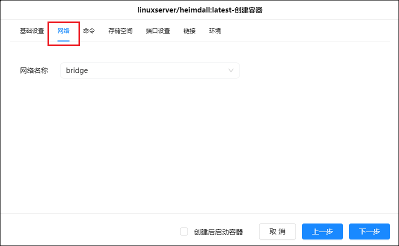
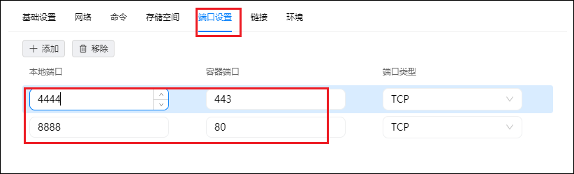

github链接：<https://github.com/linuxserver/docker-heimdall>

## 1、容器部署

1、进入绿联Docker镜像仓库，搜索heimdall，选择第一个镜像linuxserver/heimdall点击下载拉取镜像，安装版本默认选择latest。

2、下载完成后，在镜像管理中找到刚刚下载的linuxserver/heimdall镜像，点击创建容器；名称可以默认也可以自定义，点击下一步

3、在【基础设置】中，重启策略选择容器退出时重启

4、【网络】保持默认，即bridge模式

5、【存储空间】选择放置Docker的硬盘，新建文件夹，文件夹路径：
docker盘/Docker/heimdall/config，装载路径默认填“/config”，注意类型选择读写。

6、【端口设置】这里，容器端口80对应http的端口，443对应https的端口，为了避免端口冲突，本地端口需要改成其他未被占用的端口，且建议改成比较容易记的端口。

7、【环境】这里添加两条参数：PUID = 1000 PGID =1000。最后点击下一步，就完成了容器的安装配置。

## 2、heimdall主页配置

完成deimdall容器安装后，在浏览器输入ip:端口号，进入deimdall主页。

deimdall默认为英文界面，但最新版本已支持中文。首先我们先点击右侧最下面的图标进入【设置】界面。

在Language中选择Zh（chinese），点击保存即设置为中文界面。

接着回到首页，点击右侧【用户】菜单。

设置账号密码邮箱，同时勾选允许公开访问，点击保存。

点击【应用列表】菜单，然后在界面点击【添加】即可添加相关页面的快捷链接了。

deimdall自带了一些网站的默认设置、LOGO等可供选择，也可根据自己喜好进行自定义。网址可以输入相关应用的域名:端口号。（如只需内网访问则输入IP：端口号）。除了NAS内部的应用，还可以添加如百度、淘宝、京东等等外部网站，根据需求定制个人导航，同时可以进行标签的归类。

