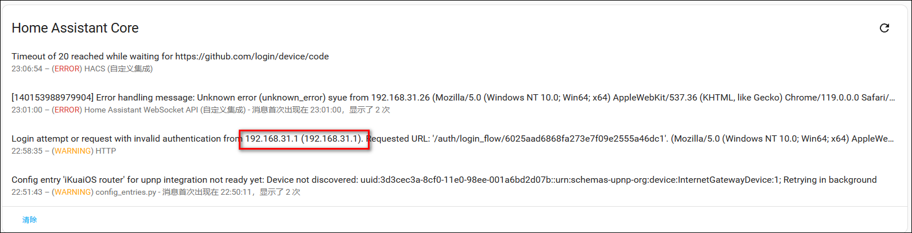
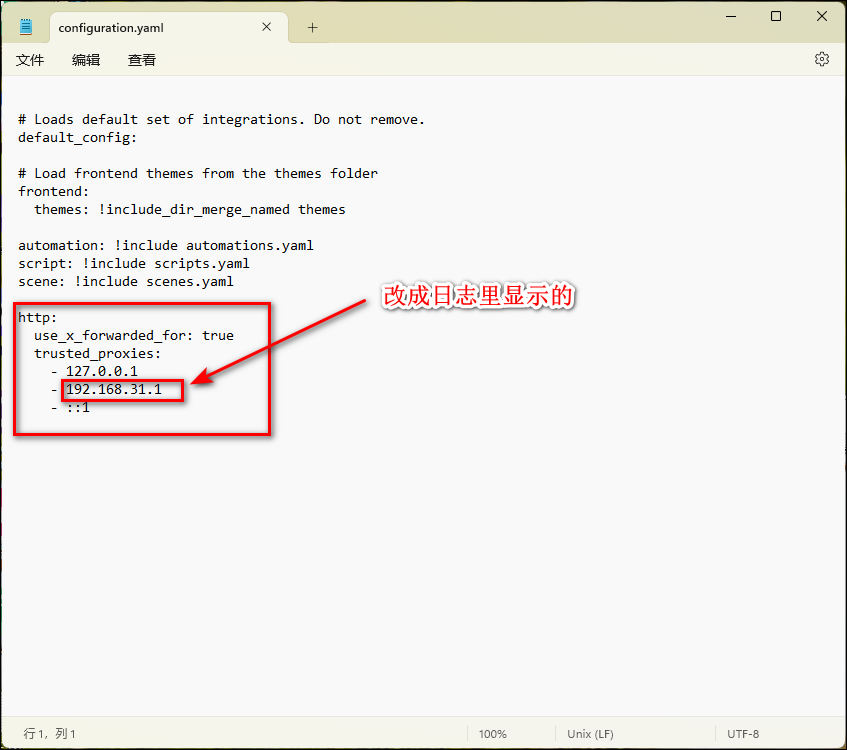

## 容器部署

### 1、镜像下载

在镜像管理-常用镜像里下载homeassistant镜像。

### 2、创建容器

1）网络：修改为host。

2）先在Docker文件夹下新建一个HomeAssistant文件夹，然后选择HomeAssistant文件夹，设置装载路径为/config。

3）“环境变量”里添加一个“变量名”为TZ，值为Asia/Shanghai的变量。

## 使用

### 1、初始化

1）打开IP:8123进入网页端，点击创建一个管理用户。

2）进入页面

### hacs

1、下载最新版hacs：https://github.com/hacs/integration/releases

2、在docekr-HomeAssistant文件夹里新建个文件夹：custom_components，并把刚刚下载的hacs文件解压，然后上传进去。上传完后重启容器。

3、点击配置-集成-添加集成，选择hacs

4、只有最后一项（实验性功能）是可选的，您需要接受上述所有内容，然后才能设置 HACS。

5、在第一个屏幕上，您会看到一个设备代码，将其复制到剪贴板，然后单击 <https://github.com/login/device> 链接以继续设置。

6、输入刚刚的设备代码来激活设备

7、点击授权hacs

8、授权成功

9、创建配置成功，点击完成

10、可以在集成里看到hacs

### 外网访问

点击配置-系统

选择网络

填写外网访问的网址

### 日志

点击配置-系统

选择日志

查看日志内容

更改configuration.yaml文件内容

