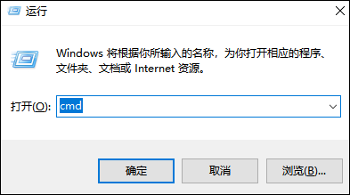

## 1、容器部署

1、打开绿联客户端的设备管理，点到调试功能，开启调试功能后会看到如下画面


2、windows可以用 win+r输入cmd打开终端



3、终端界面：


4、在终端输入命令 `ssh -p 922 root@绿联的ip`，注意ip是绿联使用ipv4 ip。 比如我的绿联ip是192.168.1.6，则我输入的命令是`ssh -p 922 root@192.168.1.6`。中间有个叫你确认的地方，直接输入yes即可。然后会让你输入密码，即在这里输入刚刚在绿联客户端拿到的验证码（在绿联点击复制后，在这里鼠标右击即为粘贴），注意这里的输入是不会显示的，请一次输入正确然后回车。


5、回车后会进行登录，登录成功后会有如下提示，然后继续输入我们的安装命令：
```
docker run -d --privileged -p 12712:12712 -e secretKey=123456 -e hubURL=https://hub.docker.com -v /var/run/docker.sock:/var/run/docker.sock --restart=always --name onekey 0nlylty/one-key-update:UGREEN
```
注意，命令中的secretKey=123456是说我设置的密码是123456，这里的123456可以改成你自己想设置的密码。


安装成功后就可以在浏览器访问IP:端口（我的是192.168.1.6:12712），然后输入你刚刚设置的密码123456，点击login。


## 使用

1、然后我们进入了主页面，它会自动检查镜像是否存在更新，当然，可能有bug，如果更新后还显示有更新的话就无视他就好。


2、需要更新容器的话就可以选择击容器，然后点击更新按钮。会询问是否使用代理，一般推荐不使用代理，如果镜像拉不下来的话再试试使用代理。


3、更新完成后会有个弹窗询问是否删除旧容器，这时候可以先不着急点，先去看看更新后的容器是否能正常运行，能正常运行的话，可以点击删除旧容器。


4、另外，如果想更换容器的镜像的版本。比如对于qd，想从qdtoday/qd:latest版本切换到qdtoday/qd:ja3-dev，那么选中容器然后点击上方的更换镜像，再输入要切换的版本然后，点击确定即可。


5、在镜像管理页面，会把没有在使用的镜像标记出来，方便管理


