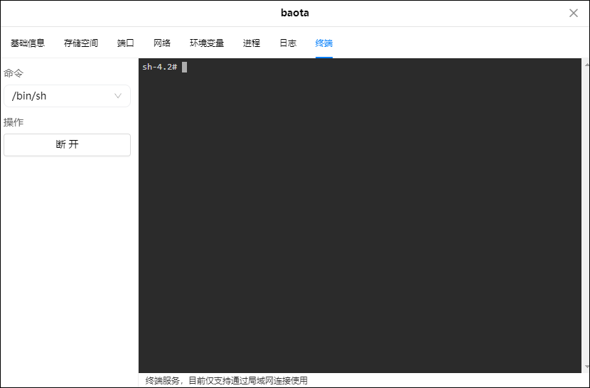

## 1、容器部署

1、点击镜像管理-本地镜像-添加-官方库，镜像名称输入：kangkang223/baota，输入后等待一下，直到输入框下方显示出下拉列表，表示从docker源加载到数据，再点击确定，因为如果不等待下拉列表直接点确定，系统会报错并提示：请输入url地址。

2、确定后弹出选择版本对话框，等待安装版本中的latest变成列表可选状态后点确定进行下载。

3、在本地镜像中找到刚刚下载完成的镜像，点击创建容器。可以启用一下资源限制，勾选创建后启动容器，点击下一步。

4、基础设置里指定重启策略

5、网络为host模式

6、在docker文件夹里新建一个baota文件夹，并新建两个子文件夹：backup和wwwroot，把它俩分别挂载为/www/backup、/www/wwwroot，类型都为读写

7、因为我们选择了host，所以不用修改这里。如果选择了bridge模式，这里自行添加需要使用的所有端口。

## 初始化

1、浏览器输入IP：8888，会出现以下界面，别慌，这是正常的

2、点击容器管理，找到安装好的宝塔容器，点击详情

3、点击终端，点击连接，注意需要在局域网连接模式下

4、连接成功后是这个界面

5、复制命令：/etc/init.d/bt default，然后Ctrl+Shift+V来粘贴命令，粘贴完成后回车后得到面板的登录地址和账号密码

6、进入登陆地址，并按它显示的用户名kangkang，密码f78679a7，来登录，发现以上信息无法成功登录，因为它是系统初始值。

7、我们再次在终端中连接，并输入cd /www/server/panel && btpython tools.py panel ugreen，其中ugreen就是我们设置的真实密码，你可以改成你自己的

8、重新输入刚刚设置的密码，登陆成功。输入宝塔账号密码，绑定宝塔账号。

9、如果没有账号点击登录上方的免费注册去注册一个。

10、绑定宝塔账号后进入控制台，可以在面板设置里修改别名、默认端口、面板用户和密码。

